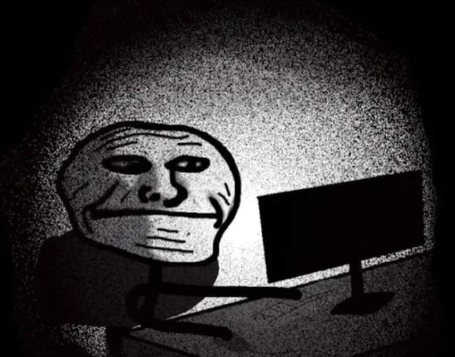

### Greetings

It seem's you've stumbled upon my little corner of the web.
This is my haven.
All are welcome and no one is watching.

### Who am I?
Nobody important in the grand scheme of things. I am someone who tries to care for people closest to them. I am someone who seeks knowledge, understanding, peace and balance. That is all. 

### Why a blog?
The internet is just an absolute sea of content. I wanted my own lil place in the world wide web that's completely uncensored and most importantly, all to **myself**.

I feel as a I get older, I've realised that its important to archive things of the past. Y'know like an old family album. You could look back and realize how much you've changed and that kinda thing. In my life, I like looking back maybe months or even years and have a reference to see my personal growth. For most people, think of like an Instagram account, kinda. Except, I **own** this place. 

### Progress and learning
When I see good progress, it feels fulfilling. If I don't, it pushes me to keep working on myself. It stops me from having regrets altogether, because I understand that growth is a slow process. This blog is sort of a shallow lens into my personal growth and the evolution of my thoughts.

Learning is pretty much my main goal. At one point, I realised its common for people to come and go as you follow your own path. **Hedonism** does not work. When the happiness fades, all I have left is my sense of fulfilment. 

### Ending off
My thoughts come and go, sometimes it's silly, sometimes it's pretty deep and sometimes in that moment, I feel excited and my creative juices are flowing. I don't want those to be lodged somewhere in my inaccurate memory bank.

I could disappear at any moment, physically or mentally, unwillingly. You never truly know. I'd like to leave some things before I eventually go. This is simply a place without the noise. 

