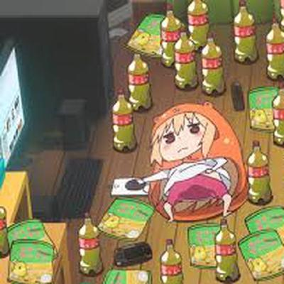

+++
author = "Josh"
title = "Dang, now what?"
date = "2022-12-10"
description = "🛏💤"
tags = [
    "personal"
]
categories = [
    "Fluff"
]
image = "tv.jpg"
+++
<!--more-->

<b>ENDED THE SEMESTER A COUPLE WEEKS AGO 🥳🉠LESGOOOOO</b>

 <video width="400"  controls>
  <source src="friday-night.mp4" type="video/mp4">
Your browser does not support the video tag.
</video> 

Was really happy with the results. Pure relief man. 

My dreads are getting hella long now which is dope. I didn't re-twist AND cut them since the start exams and it's been bothering me so much. I just was just a caveman wearing a beanie everyday. 

I went clubbing before exams and I lost my wallet that night. I drove to campus every single day without a license, no credit card and no ID. Professional dumbass 😎👍.

So, I'm glad I finally have time now to sort these things out.

Being home is kinda boring tho not gonna lie. But I got a couple things to keep me busy.

  

## What I'm working on - Prototype



I made a state machine package for unity recently. Its still in development but I wanted to test it out. 

I really love [Celeste](https://en.wikipedia.org/wiki/Celeste_(video_game)) , it's one of my favourite games and I really wanna recreate some aspects of it. Something mixed with celestes parkour and some survival/dungeon elements would be cool. The problem is celeste's character controller is like 2k lines alone, so I've been rewriting it in a modular fashion where I hopefully just pop it into another game.

## Recent Events and Stuff

I got my first [internship](https://www.toxyngames.com/) which is dope. 
Whats great about it is that it's during the holidays so it won't affect me next year.

Also I wen't to this [game dev/design event](http://gamesweek.africa/) called Africa Games Week recently. 
It was pretty cool. Enjoyed the people more than anything else to be honest. There were talks but I personally didn't find them all that interesting because they weren't technical type talks. More like overview type talks. 
Generally, really enjoyed it.

I still can't believe it though dawg, I met [Thea Booysen](https://www.instagram.com/thea_booysen/?hl=en) on the first day, of whom is [Mr Beast's](https://en.wikipedia.org/wiki/MrBeast) current girlfriend. 

Like bro, wtf what are the odds. Why it was so suprising is because she was incredibly down to earth and so friendly. I was genuinely shocked after I found out later. So far all the "celebs" I've met include Jack Parow, Marc Lottering and Riaad Moosa of whom are all local SA celebs.

But like, whats different compared to the previous instances was I had no idea of her being 'famous'. I just conversed normally like it was any other person.

Epic shit.

## What now

Idk. I'll work on da prototype and relax in the holidays.
Cya bros 😸🤜🤛😁.

