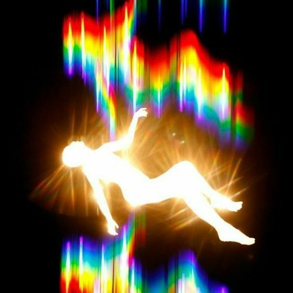
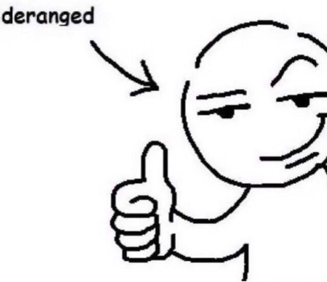

+++
author = "Josh"
title = "Music and 21 Savage"
date = "2023-05-02"
description = "4L"
tags = [
    "learning",
    "mindset"
]
categories = [
    "Music",
    "Fluff"
]
image = "thumb.jpg"
+++
<!--more-->

## Context
I've been expanding my music taste recently. Music is extremely important to me ❤️ 
\
If the melodies are not hitting my soul I don't want it.

  

I've had a few experiences recently that I believe has shaped me quite a bit. Learnt a lot of lessons.
These include:

* Believe in yourself over everything else
* Experience new things
* Question everything
* You cannot predict anything

I've never listened to music as much as I did at this point of my life before. In a normal day, I easily hit 2 hours of listening as a minimum. Not simply just one genre, it ranges from:

- Rap (Trap/Boom-Bap)
- Melancholic sounds
- Euphoric, percussion heavy melodic tracks
- Slow, meditative downtempo
- Energetic techno/core

I feel like with this selection, I get the range of emotions that I want, depending on the time of day.

  

Anyways, what I'm getting to is, in this 'expansion', there's one artist that just makes me feel a different kind of way. The man himself, **21 Savage**.

  

## My history with Rap Music

I've listened to plenty artists and genres within rap in general but I'm going to touch on what I think is most memorable to me.

If I were to go all the way back, boom-bap was my entrypoint which is why the relatively 'modern' [1999 by Joey Bada$$](https://en.wikipedia.org/wiki/1999_(mixtape)) is still my favourite album of all time. I loved the complex storytelling aspect of boom bap. It felt like every single song just had so many layers that you would slowly peel back. Simply 10 listening sessions was not enough. You could go back after a few months and you might be able to connect the dots differently or find hidden meanings that weren't exactly as apparent as before. Figuring out those triple entendres made you feel like an absolute genius. State of Mind by Nas is a classic.



Now it sort of feels like I can't relate because it comes from a time that was just so long ago. Feels more like old history. I guess the lyrics aren't hitting me as hard nowadays. Its quite difficult to describe. 

## 21 Savage

I used to think trap rap was 'corny' a long time ago because it wasn't as complex lyrically. Like they were just trying to sound 'cool' by saying 'bad' things. Thought I was some kind of 'intellectual' by caring about 'real rap' because it was more poetic.

  

Just gonna preface for anyone that might feel offended, especially religiously, this is my opinion. Feel free to disagree. I will try and sound like I'm not a bad person 😅

I realize now that I just couldn't relate at all when I was younger and more naive. Life is everything. 'Bad' and 'Good' if you wanna call it that. We all have this dark, villainous side deep down. Not necessarily 'emo' or sad. We try and hide it to play the game of life. Its important we embrace that energy(within reason obviously) because like other energies, its powerful and moving. We're built for survival, along with kindness and humanity, these are contrasting energies. Certain circumstances bring out different sides of you. Pain and struggle is one of the best teachers.

Kind of thinking of getting a padlock on my neck for this reason and more but maybe thats a bit too intense for now 😅

There's two ways I believe you can reminisce about a 'bad experience'

This thing happened to me in the past, therefore

* It's a part of me, I can be sad about it
* It's a part of me, it makes me stronger

The absolute energy savage gives me man. He makes me feel like a monster. The second the beat drops, my body's already moving. He makes me feel like, all the bad things I've done, all of the mistakes and all of the hard times I've been through doesn't matter in the slightest. You need hardship. Things that take you to the edge and make you a beast. It's all part of the path to growth.

Like everything can be yours to take if you have the grit and resolve 🔪🩸

His music is insanely inspirational. It feels too real. He's been through so much, more than you would believe. Despite the dark sounds and horrific nature of some of the lyrics, he's crafted a persona built by the terrible times of his past that millions of people can get behind, including myself.

## Ending Off
I hope you enjoyed the short read.
I would have liked to share my favourite songs and more information, but I'm afraid its far too explicit to post unfortunately. Hopefully I've added an interesting perspective.

