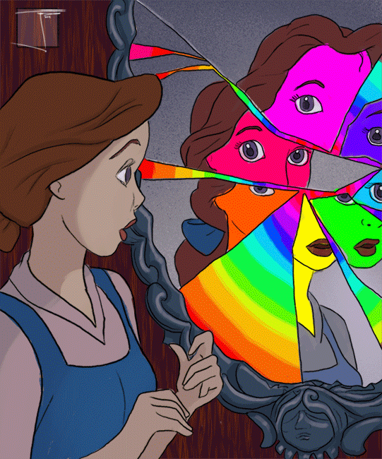

+++
author = "Josh"
title = "What is Limerence? 🧠"
date = "2023-05-23"
description = "The mind can be both your greatest ally and fiercest adversary | 💗⚔️ "
tags = [
    "learning",
    "mindset"
]
categories = [
    "Educational",
    "Fluff"
]
image = "thumb.png"
+++




## Context

I've decided to undertake therapy recently. I've noticed a significant change in my behavior and thoughts as a result of several events occurring in close interim, not necessarily because of a negative mental state. 


<p align="center">
  
</p>


The last time I'd been in therapy was back in highschool. 

That experience taught me to immediately open-up as a sort of preventative measure of inadvertently remaining in a state of mental rumination, which in everyday conversation means *being in your own head*.


For all it's worth I think thats fairly significant. Key things I've identified about myself include:

* Being emotionally unavailable
* Difficulty comprehending empathy
* Putting a shield over my heart in order to protect myself

Men are often taught to dismiss, disregard or suppress their emotions as a result of societal expectations. 

I look up to my dad because he's my superman. He never lets emotions cloud his judgement and I feel that I'm on the same path, although he is much more emotionally intelligent than I am.

I truly believe I have a strong sense of identity, but right now it feels like there's many parts of myself that I selectively show to specific people.

<p align="center">
  
</p>

<center>
<b>Why?</b>


I do this in an attempt to min/max and allow everything I desire to manifest.

<p align="center">
  
</p>


Am I delusional? Yes very much so 😎👍
</center>

If I were to reflect on my past relationships, it seems that whenever I have shown vulnerability, it's often backfired or resulted in negative consequences. As if the more exposed I am, the more I could invite unnecessary harm upon myself.


<p align="center">
  
</p>


But how do we cultivate long lasting quality friendships without vulnerability? How do we nurture them without expressing emotions? That's obviously not possible.

<p align="center">
  
</p>


I came across this term on the path to understanding myself more, called [Limerence](https://en.wikipedia.org/wiki/Limerence) . I went on sort of a spiral with this term and it really intrigued me. From this point onwards the post will be less personal. 


## What is Limerence?

The term "limerence" was coined by psychologist Dorothy Tennov in her book "Love and Limerence: The Experience of Being in Love," which was first published in 1979. That was about four decades ago.

While the term itself may not be widely known outside of psychology, the experiences and behaviors associated with limerence have been observed and discussed for a really long time.

<hr>

Limerence has been acknowledged as a psychological phenomenon and has garnered attention in the study of romantic relationships and attachment. 

It is a mental state characterized by infatuation, often in a romantic/sexual context. It involves being deeply captivated by someone, fixating on them, and experiencing strong yearning and longing. 

Importantly, limerence revolves around an idealized version of the person, crafted within one's mind, rather than a true representation of who they are. This captivating state is involuntary, and individuals affected by limerence cannot easily control or choose their feelings towards the person of their infatuation.

<p align="center">
  
</p>


Life's unpredictable nature never fails to astonish me. None of us truly know anything for sure, it's as if we're all blindly following one another. You would think that we have a choice on what intrigues us or the freedom to choose what we find captivating. Like the preconceived notion of what we supposedly find attractive is absolute when in reality that's far from the truth. It's all an illusion.

I will return to limerence, for now I think it's a good idea to explore the definition of addiction since the two phenomena share some similarities.


## Understanding Addiction

<center>
Our mind easily tricks us into thinking we're in control.
</center>

<p align="center">
  
</p>


At first, it may seem like we have a say in whether or not we engage in addictive behaviors. We might convince ourselves that we can stop at any time or that we have the willpower to resist temptation.

<center>
We might go on to say, <i>"Oh yeah I can stop this thing for three weeks"</i>
</center>

On a deeper level, the three weeks was always accomplishable, reinforcing the illusion that we're in control. 

<center>

```
Delulu 🤪🤟
```
</center>

It was not an arbitrary duration, it came from somewhere. The truth is that these self-imposed limits are meant to maintain the illusion of control rather than challenging the addictive patterns. Addiction operates on a deeper level, beyond the realm of conscious willpower. The cravings and ingrained patterns of behavior will persist, waiting for an opportunity to resurface and overpower our self-control.

<hr>

<p align="center">
  
</p>

<center>
    <i>The sense of enlightenment is evident in [Figure 5], as this astute canine intently reads my post and makes a connection between its behavior and its owner's treats</i>
</center>

<hr>

Behaviors that trigger addictive responses activate the brain's reward pathway, flooding it with dopamine. This flood of pleasure reinforces the desire to repeat the behavior, leading to a cycle of craving, indulgence, and temporary relief.

To truly grasp addiction, we need to recognize its complexities and understand that it's not just about willpower or making choices. It's a complicated condition that messes with our reward systems, our thoughts and behaviors.

<hr>


<p align="center">
  
</p>

To digress a little bit, 'Chocolate boy' was a character in [Hey Arnold](https://en.wikipedia.org/wiki/Hey_Arnold!) that was a metaphor for substance abuse/addiction that aired on [Nickelodeon](https://en.wikipedia.org/wiki/Nickelodeon). Thought this was interesting to share.

 

<center>

Pretty dark for a children's show. 
</center>


## The Link Between Addiction and Limerence

While limerence is not synonymous with addiction, there are notable connections between the two that I'll explore in the subtopics below.


<p align="center">
  
</p>

Before I dive into this section, I think its important to understand that limerence is not a bad thing. It's a natural phenomenon completely out of our control. However, it can be harmful if we can't recognize or comprehend the extent of its effects.


<hr>


### Similar Neurochemical Processes

Both experiences involve the release of dopamine. In addiction, substances or behaviors trigger dopamine release, reinforcing the desire to repeat the behavior. Similarly, during limerence, the presence or even the mere thought of the desired person can stimulate dopamine release, stimulating pleasure.


<p align="center">
  
</p>

### Obsessive Nature and Compulsive Behavior

Limerence often manifests as an obsessive preoccupation. Individuals experiencing limerence may engage in repetitive thoughts, daydreaming, and fantasizing about the desired person. This nature bears resemblance to the compulsive behaviors observed in addiction. Both limerence and addiction can drive individuals to engage in repetitive and sometimes harmful actions, even against logical judgement.

<p align="center">
  
</p>

### Escapism and Emotional Dependence
Both addiction and limerence can serve as forms of escapism or emotional coping mechanisms. People may turn to addictive substances or behaviors, as well as limerent fantasies, to escape from reality, numb emotional pain, or find solace. In both cases, the underlying motivation often stems from a desire to fulfill unmet emotional needs or seek temporary relief from psychological distress.

<p align="center">
  
</p>


### Interference with Daily Functioning

Addiction and limerence can significantly impact daily functioning and overall well-being. Both can consume a person's thoughts, making it challenging to focus on other aspects of life. The pursuit of the addictive substance or the limerent person can overshadow responsibilities, relationships, and personal goals, leading to disruptions in various areas of life.

<p align="center">
  
</p>


## The Difference between Love and Limerence

I don't think there's a necessity for me to explain what love is. 

The distinction between love and limerence is often a source of confusion. They're sort of a union. Both involve intense feelings for another person but there are important differences to consider. Whats even more confusing is,

* Limerence can evolve into love over time.
* Love can evolve into limerence over time.
* Love and limerence can coexist or evolve over time.

Making it even more difficult to distinguish between the two.

<p align="center">
  
</p>


Usually, in the early stages of a romantic relationship, limerence may be more prevalent, while love develops and deepens over time as the relationship matures. In rare cases, limerence may even develop in the context of an existing long-term relationship.

<hr>

### Key Differences

* Limerence is often accompanied by feelings of anxiety and uncertainty, whereas love is secure.

* Love is a deep affection and attachment to someone that has stood the test of time, whereas limerence is typically a short-lived infatuation with someone. 

* Limerence is a state of mind that can be triggered by a romantic interest, whereas love is a stable commitment to someone regardless of whether or not the person is reciprocating feelings of affection.

* Limerence is often characterized by obsessive thoughts and fantasies about the desired person, whereas love is more grounded in reality and involves a deeper, more unconditional acceptance.

## Evolutionary Perspective on Limerence

Reproduction is a fundamental part of human nature. It's a biological imperative that has been ingrained in our DNA through millions of years of evolution. The drive for limerence is a byproduct of this evolutionary process and it's almost always associated with lust, romantic or sexual desire.


<p align="center">
  
</p>


<center>
Why? 
</center>

Put simply, its a mechanism that helps us find a suitable mate and increase the likelihood of survival for our offspring. The heightened state of arousal and infatuation limerence induces leads people to engage in behaviors that are conducive to attracting and maintaining a romantic partner, for example:

* Efforts in courtship
* Displays of affection
* Emotional bonding


### Modern Day Implications of Limerence in Relationships

While limerence may have evolved as an adaptive mechanism for mate selection specifically, it is not the sole determinant of successful long-term relationships. Factors such as compatibility, shared values, communication styles, emotional connection and commitment also play significant roles in the formation and maintenance of relationships.

Limerence can sometimes be so powerful that it can overshadow these factors and possibly lead to an imbalanced and unsustainable relationship dynamic.


## Ending Off

I really enjoyed writing this post, was a fun topic to explore.
I think its important to understand the science behind limerence and how it affects our lives. 

I had no idea that a term for this phenomena even existed. I'm sure there are many people out there who are experiencing this and don't know what it is.

I hope you enjoyed reading it as much as I enjoyed writing it. It seems like most of my non-technical posts are leaning into the psychology side of things and I'm all for it.
<center>

<p align="center">
  
</p>

Have an amazing day ❤️

</center>


