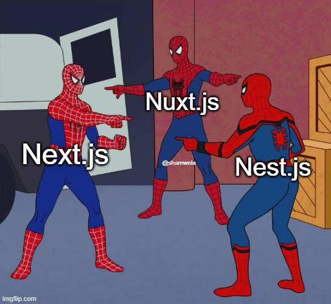

+++
author = "Josh"
title = "Nuxt + Supabase is Awesome 😍"
date = "2023-08-21"
description = "Select * from deez 🥜"
tags = [
    "development",
]
categories = [
    "Programming"
]
image = "thumb.jpg"
+++

# Context

I found an awesome skating group on called Queer Skate CPT. My girlfriend and I joined one of their sessions at the Mill Street Bridge Skate Park and we loved it. Everyone is super friendly and the sessions are welcome to anyone and everyone from all backgrounds and/or skill ranges.

Their socials:
* [TikTok](https://www.tiktok.com/@queerskatecpt)
* [Instagram](https://www.instagram.com/queerskatecpt/?igshid=MzRlODBiNWFlZA%3D%3D)


<div align="center">

 <video width="260px" controls>
  <source src="ramp.mp4" type="video/mp4">
Your browser does not support the video tag.
</video> 
<p> This is me going down a ramp ( Still learning 😳) </p>
</div>

I found them on TikTok initially, but it was sort of a struggle to know **when** and **where** exactly their next event was.
I did some digging and found their Instagram, this was where the event details were.

After finding their page on TikTok, I took the following steps to know where and when their next event was:

1. Find the Instagram link from their TikTok Page
2. Scroll through their Instagram and find the latest post regarding the details
3. Search the location on Google Maps if I was not already familiar with it

After some brainstorming, I thought why not just make a website to centralize the event details and make this process easier?
What if, on a single page, you could have the time and location right there with a link to open it in Google Maps?

## What I needed to make this work

1. The CRUD interface needed to be mobile friendly for maximum flexibility and ease of use
2. A login system to make sure only authorized users can edit the data
3. The cheapest possible database solution with a realtime data option

## Problems I ran into initially

I simply used vue only, which was my biggest mistake. I had this thought in my mind that [Nuxt](https://nuxt.com/) would be too complicated to learn.

Some parts of the app needed to be server side (landing page) and some parts needed to be client side (admin pages).

<div align="center">
 
</div>

For the database, I initially used firebase realtime database. Not the best option for a hobby project.
Their was just so much documentation, it was very confusing and I had to create ugly wrappers to make the process easier. NoSql was fine, but it just didn't feel like there was much rigidity and safety with that sort of setup. I needed to make this thing in a short amount of time. I took a massive break and thought that there's gotta be a better way to do this.


## My Experience with Nuxt

What stops me in general from learning new things is, if I have no use for it, why should I learn it?


<div align="center">
 
</div>


I learnt the basics of  html and css simply because I wanted to make my own portfolio website.
Then I learnt javascript and vue because I needed to make it organize my project and implement more complex behaviour.
Then, I discovered writing css and implementing custom components is absolutely painful and [Tailwind CSS](https://tailwindcss.com/) combined with component libraries ( [DaisyUI in my case](https://daisyui.com/) ) became my saving grace.

Using vue alone will only get you client side functionally, I needed the whole shebang for a proper CRUD application.
Nuxt made the most sense here, and I absolutely love it.


The developer experience is top notch, they have [modules](https://nuxt.com/modules) for absolutely everything you might need (devtools, components, dark mode, markdown rendering etc)

Auto imports are fantastic, the folder structure setup is fantastic, the docs are fantastic, I absolutely love it. It really is a super-charged dev experience. Everything is simple and powerful. It didn't take too long to get familiar with it.


## Supabase

I LOVE supabase. No loading your credit card upfront, no complicated documentation. You can get your project up and running insanely fast.

* Authentication and alternate providers (google, github etc) ? DONE
* Realtime data? DONE
* Storage? DONE

The [nuxt-supabase  module](https://supabase.nuxtjs.org/) provides first-class integration that makes things just so easy.


For a sneak peek, this is how easy it is to do the following: 

Check if a user is logged in (can also do it in middleware)
```ts
<script setup lang="ts">
const user = useSupabaseUser()
watch(user, () => {
  if (user.value) {
    return navigateTo('/admin')
  }
  else {
    return navigateTo('admin/login')
  }
}, { immediate: true })
</script>
```

Realtime Connection

```js
client
    .channel("custom-all-channel")
    .on(
      "postgres_changes",
      { event: "*", schema: "public", table: "SkateEvents" },
      (payload) => {
        const { eventType } = payload;

        if (eventType === "INSERT") {
          events.value.push(payload.new);
        } else if (eventType === "DELETE") {
          const index = events.value.findIndex(
            (event) => event.id === payload.old.id
          );
          events.value.splice(index, 1);
        }
      }
    )
    .subscribe();
```

## Working Demo

This is everything up and running so far. Once I feel it's polished and I make sure there are no security vulnerabilities I'll release the source code and deploy it.

So far I've used:

* [DaisyUI](https://daisyui.com/)
* [Tailwind](https://tailwindcss.com/)
* [Supabase](https://supabase.com/)
* [Vue 3 Google Maps](https://vue-map.netlify.app/)

<br>

<div align="center" style="display:flex; flex-direction:column; gap: 20px" >
 <video width="95%" controls>
  <source src="login.mp4" type="video/mp4">
Your browser does not support the video tag.
</video>
<p> Login </p>

 <video width="95%" controls>
  <source src="realtime.mp4" type="video/mp4">
Your browser does not support the video tag.
</video> 
<p> Full Working Demo </p>
</div>
