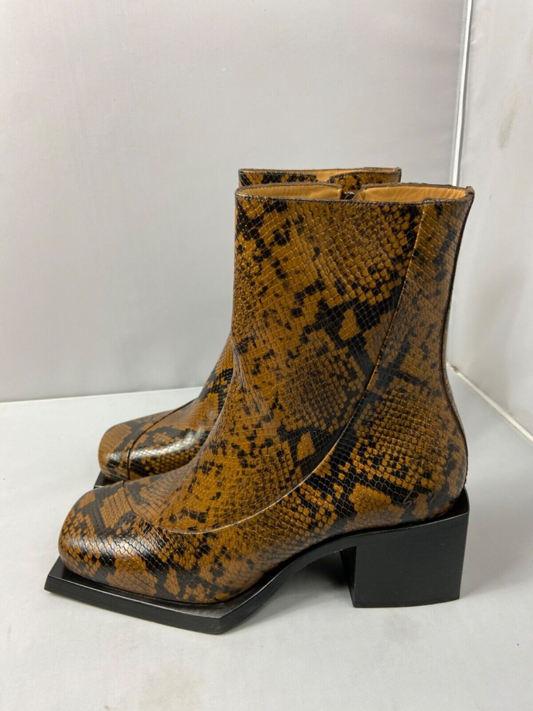

+++
author = "Josh"
title = "Jersey Club! 🕺"
date = "2023-07-15"
description = "Hips to the move & body to the groove...ㅤㅤI'll walk myself out 🚪"
tags = [
    "learning"
]
categories = [
    "Fluff",
    "Music"
]
image = "thumb.jpg"
+++

<h1>I LOVE JERSEY CLUB 😍</h1>



## Context

The most popular jersey club song to release in recent time was Lil Uzi's ['Just Wanna Rock'](https://youtu.be/UhbixyxgsiU) which at the time of writing this came out **7 months ago** and has since hit **106 million** views on youtube 🤯

I hated the song at first. I was sort of taken aback by the sound. It sounded completely different to what I was generally used to when it came to hip hop.
It was sort of a hype-beat that was ridiculously easy to dance to. I remember on my first listen, my brain was like 'no, why did the music do that' and then I skipped it 🥱

### The Hillbillies by Baby Keem & Kendrick Lamar

I heard 'The Hillbillies' by Baby Keem & Kendrick Lamar, and for some reason the beat sounded familiar. I have never ever heard Keem or Kendrick on this type of beat before, so I was really confused. Not a fan of the song either, but I'm glad kendrick is living his compton cowboy fantasy.

Aren't these $940 dollar boots just soooo good? 🤠



There were a few people that were like 'Wait they stole the beat from 'Sticky' by Drake' and I was like 'What the hell is 'Sticky' by Drake?' and then I listened to it. Rocket science, I know.

### Sticky by Drake

My brain LOVED 'Sticky' 😍. I liked how the lyrics are ambiguous and up to interpretation while the the kicks are accentuated in the sound, like they own the stage entirely. It's got a beautiful melancholic vibe to it, just like the very first song I linked at the start of this post. 

Sooo good! Mwah. Belissimo. Perfecto.

Absolute bopper popper my schmopper to schnizzle my nizzle (I wrote this at 8am) 🐴



## What is Jersey Club?

### Formal Definition

Straight from the young wikipedia:

Jersey Club, also known as Brick City Club, is a genre of electronic dance music (EDM) that originated in Newark, New Jersey, United States. It developed in the late 2000s and gained popularity in the 2010s. Jersey Club is characterized by its high-energy, uptempo beats, rhythmic vocal samples, and repetitive, percussive loops.

The genre draws influences from various music styles, including hip-hop, Baltimore club, and house music. Jersey Club tracks often feature chopped and looped vocal samples from popular songs or classic R&B tunes, creating a unique and recognizable sound. The beats typically range from 130 to 140 beats per minute (BPM), giving the music a fast-paced and lively feel.

### My Definition

Jersey Club is a vibrant and infectious **boom * pause/clap * boom boom boom boom * pause/clap * boom boom-** musical tapestry that demands your attention and compels your body to move.

There's a few ways music can utilize a sort of 'call to action'. Kind of like 'hey give your attention to me right now'.

Including but not limited to:
* Lyrics
* Sound Layering
* Melody and Chorus
* Emotional Impact

With jersey club, you NEED to move. It's a crime not to. The beat and melody is pretty much in your face constantly throughout listening. For myself, there's no way I'd unironically listen to jersey-club song and not vibe out, like I would normally with some rap or r&b songs.

*Yes I know tracks can have multiple genres I'm pretty sure you understand what I mean, tysm ilu ❤️*

## Conclusion

I'm not exactly knowledgeable about the music industry, but I'm pretty sure this is the new 'wave' at this point, I don't see that changing as long as massive artists like the above are releasing bangers like these in quick succession. I'm definitely all for it.

