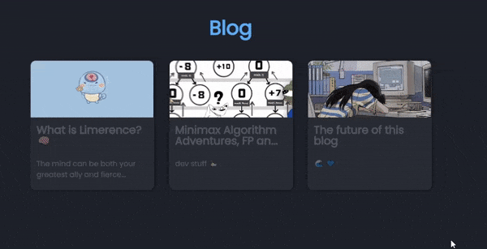
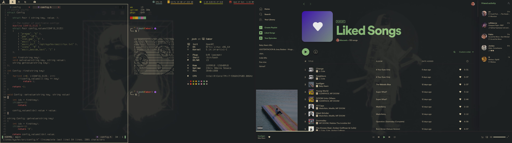
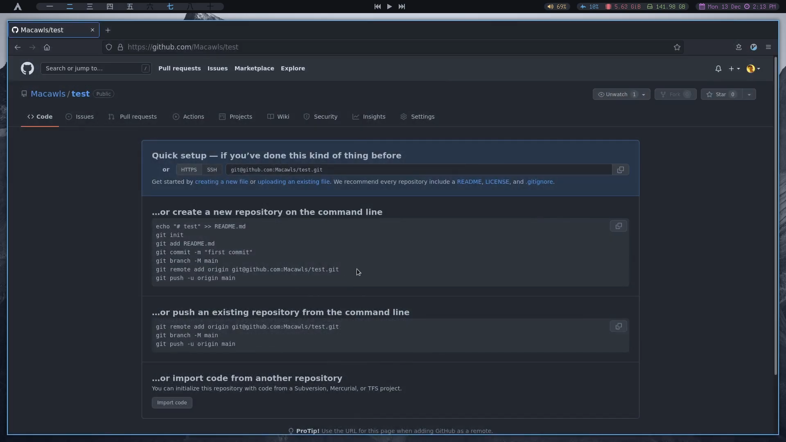

+++
author = "Josh"
title = "Updates n' stuff that you should most definitely care about because it is 100% relevant 😎👍"
date = "2023-06-26"
description = "Sent my girl to the store cos we ran out of soda 🥤"
tags = [
    "development"
]
categories = [
    "Fluff",
    "Programming"
]
image = "thumb.jpg"
+++

## One of the best nights of my life

Words aren't enough to describe it. I wore a slick all black outfit. Felt like I was in the matrix (I have never seen the matrix).

Sick techno, crazy vibrations, beautiful and dark underground atmosphere, amazing visuals. I had so much energy and never wanted to stop. There were so many times I completely forgot I was dancing. Pure bliss.

<center>

</center>

My dancing partner elevated the entire experience to new heights. We appropriately called it '**Jolling to the Max**' and moved in perfect harmony for hours. The music was just sorta "boom boom boom-" with insane kicks. But not the average "boom boom boom~". The proper "dumb dumb dumb~".

Like the "badoom, doom doom sha doom badoom~" that consumes your entire being.
High energy stomping from 10pm till 4am underground. Absolutely mental.

A co-coordinated escort happened outside where there would be checkpoints of guards. They were all communicating to make sure everyone got in their uber's safely. It was really cool to see, something out of a movie.



<hr>

## Dev Updates
I'm really excited for next semester because we'll have two programming modules instead of one. Apparently we're going to be doing some OpenGL with C++ and Kotlin with Android
Studio which is really cool. I'm super burnt out of any and all things Unity related.

<hr>

### Macawls.dev 

I wanted to display some recent blog posts on my [main site](https://macawls.dev/). The problem was hugo statically generates my blog. I didn't have a clean way to retrieve post data other than web scraping. I introduced a skeleton loading component to make it feel seamless.

<center>
Simulating a slow connection for your viewing pleasure 👽 <hr>
</center>

<center>

</center>

It takes roughly between 50ms-200ms on a good connection, around 600ms with a 3g connection which is definitely good enough. I'm glad I didn't have to explore other solutions.  Doing a parallel ```promise.all()``` type of thing was actually slower than doing it sequentially. I'm guessing it's because of the overhead of creating promises.

```js
async fetchPostData() {
    const baseUrl = 'https://macawls.dev';
    try {
        const response = await axios.get(baseUrl + '/blog/');
        const $ = cheerio.load(response.data);
        const $articleList = $('.article-list');
        const blogPosts = [];

        $articleList.find('article.has-image').each((index, element) => {
            if (index < this.limit) {
                const $currentArticle = $(element);
                const titleElement = $currentArticle.find('.article-title a');
                
                const post = {
                    title: titleElement.text(),
                    subtitle: $currentArticle.find('.article-subtitle').text().trim(),
                    imageSrc: baseUrl + $currentArticle.find('.article-image img').attr('src'),
                    href: baseUrl + titleElement.attr('href'),
                    date: $currentArticle.find('.article-time--published').text(),
                };

                blogPosts.push(post);
            }
        });
        // stuff
    } catch (error) {
        console.error('Error fetching posts:', error);
    }
}
```
Css took like 10 times longer to do, but I also suck at it.


### Bomba Prototype

I'm really excited to deploy this game soon. I talked about it in the [minimax post](https://macawls.dev/blog/post/minimax-algorithm-adventures-fp-and-oop/) earlier in the year. I've some gameplay footage below. Basically you **shouldn't** be the last player to cause three tiles in a row, either horizontally, vertically or diagonally.

<p align="center">
 <video width="100%" controls>
  <source src="gameplay.mp4" type="video/mp4">
Your browser does not support the video tag.
</video>
</p>


### Old rices

Found some super old rices back in my yee olden days 😪. Really brings back memories. 





### FreeCodeCamp API Certificate

<center>

[Certification Link](https://www.freecodecamp.org/certification/Macawls/back-end-development-and-apis)
</center>

It was pretty cool, although I didn't feel like I learnt much on the technical side because we were using [Express JS](https://expressjs.com/). I should really learn typescript, but I don't care enough right now to be honest. I should've explored web dev a long time ago, it's really fun. I wish they incorporated it our curriculum at school.

Json is goated 👑

If anything it massively improved my understanding of [RESTful API's](https://www.redhat.com/en/topics/api/what-is-a-rest-api). I used Insonmia to test my API's and really enjoyed it actually. The whole thing got me excited to deploy an API using ASP.NET, preferably using the minimal API route. I've got a project idea on the backburner to replace my [Apu Image Gallery](https://macawls.dev/apu-gallery/) with a full blown API and then a seperate polished frontend. I really wanna learn Svelte because I've been binging a bunch of [Rich Harris'](https://twitter.com/Rich_Harris) interviews 😅.
