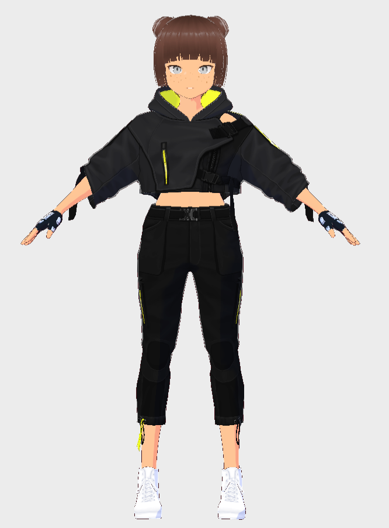
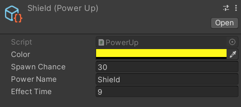

+++
author = "Josh"
title = "Endless Runner Continued"
date = "2022-06-17"
description = "🎮💻"
toc = true
tags = [
    "development",
    "unity"
]
categories = [
    "programming"
]
image = "char.PNG"
+++
<!--more-->

## Improvements
Alright this one is leagues better than the other [version](https://macawls.dev/blog/post/my-first-unity-project/).
To be honest the code in there is embarrassing, but I guess that's the point of learning. Someday I'll look back at this specific project and probably think its trash.

I'll be able to make the repo public once the final is complete and uploaded for school. Mainly going to talk about the improvements in this blog. Unfortunately I can't host the WebGL build anywhere, It's pretty massive. 

### The Character 
The character in the game was made using Vroid Studio. I tried making it look sort of like Mirror's Edge's Main Character, Faith. The importing process from Vroid to Unity was Seamless.



### Tile Spawning
In the last project, I would have the character **AND** the ground plane move forwards, which honestly made no sense, so I decided to scrap it and start fresh. With the new implementation, the character is essentially standing still while the ground moves backwards, giving the illusion the character is moving. I added some noise on the camera for the handheld effect. 

```csharp
private void ManagePath()
{
    float newZPos = _pathQueue.Peek().transform.position.z + (_tileZLength * _pathQueue.Count);
    var newTile = SpawnNewTile(newZPos);
    _pathQueue.Enqueue(newTile);
    Destroy(_pathQueue.Dequeue(), 1f);
}
``` 

I would have this method run on the event that the player passes the first tile in the queue and the process would repeat. Queues are actually pretty cool, first time it felt intuitive to use it. 
### Death
On the event the player dies, I would have different camera transition effects and animations depending on how they died. It was actually so much better for player feedback, really made you **feel** like you died.
```csharp
private void OnEnable() => GameManager.Instance.EventsManager.OnPlayerDeath += KillCharacter;

private void KillCharacter(bool falling)
{
    _charMovement.enabled = false;
    if (falling) {
        // cool stuff
    }
    else {
        // cool stuff
    }
}

```
### PowerUps
I finally got around to learning scriptable objects, really useful. PowerUps definately made the game feel alot more fun.



I wrote this really really neat function using a Sine Function to flash the outline of the character depending on how much time is left on their pickup. Results were amazing. Should have paid more attention in math class 🤓. 

```csharp
private IEnumerator ColorOutline(Color desiredColor, float duration, float multiplier, float power) 
{
    _material.SetColor(RimColor, desiredColor);
    float time = 0;
    while (time < duration)
    {
        float liftValue = SinFunc(0.25f, 0.25f, time, Mathf.Pow(time/duration * multiplier, power));
        time += Time.deltaTime;
        _material.SetFloat(RimLift, liftValue);
        yield return null;
    }
    ResetMaterial();
}
```

### Ending Off
This project was pretty fun so far. 
One major problem I have is scalability and really understanding OOP concepts and I'm definately looking to improve on that. Overall, I'm really happy with the progress. 

