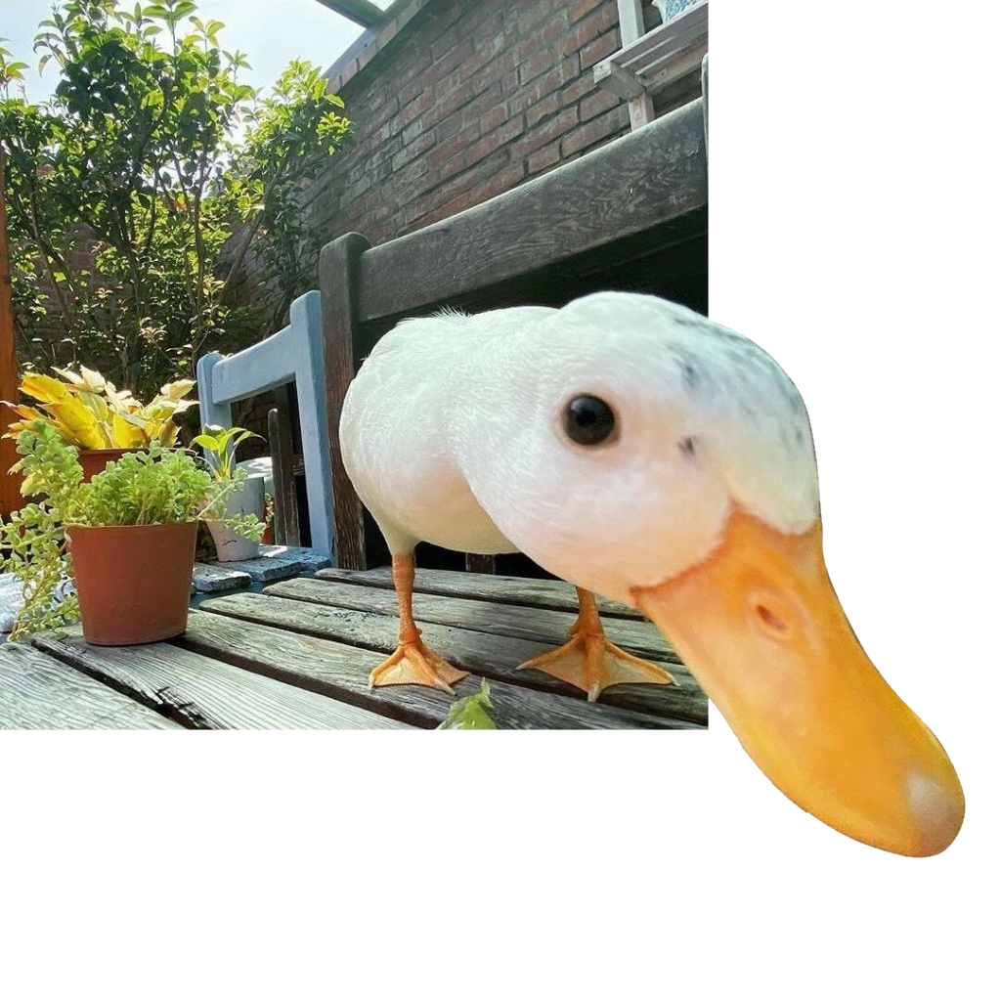
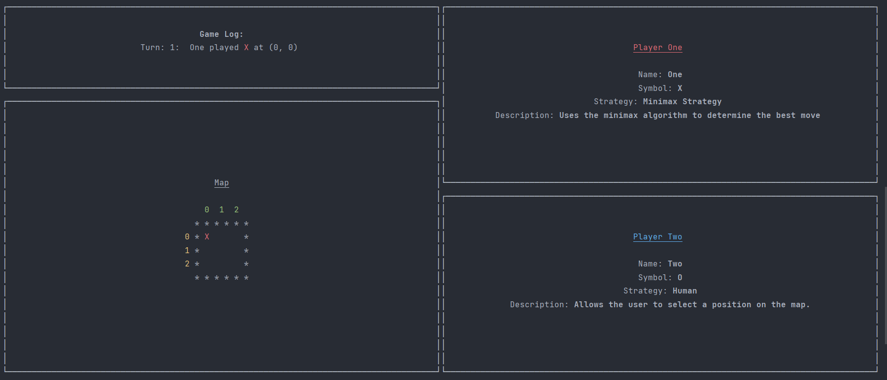
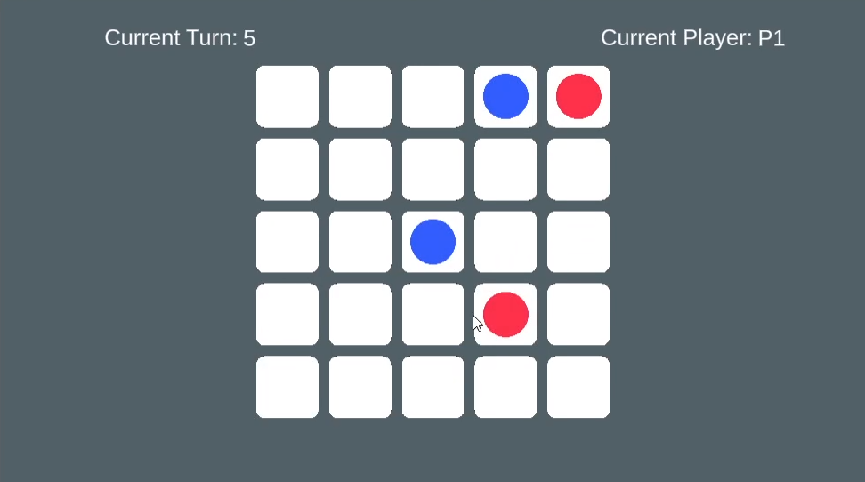
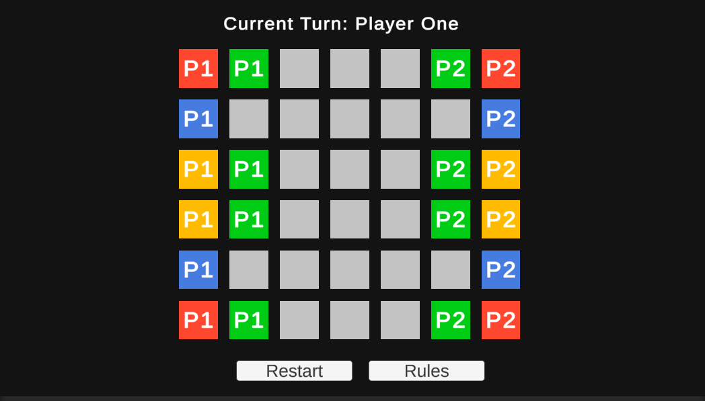
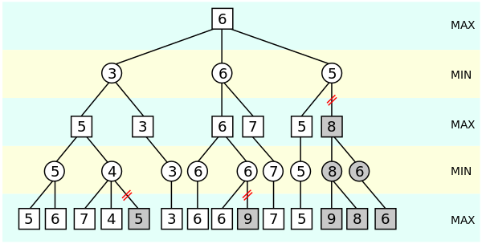

+++
author = "Josh"
title = "Minimax Algorithm Adventures, FP and OOP"
date = "2023-04-15"
description = "dev stuff 🦆"
tags = [
    "learning",
    "development"
]
categories = [
    "Educational",
    "Programming"
]
image = "thumb.png"
+++
<!--more-->

## Functional and Object-Oriented Programming

I took a massive break from touching the Unity Engine and I recently got back into using it.
In general, even if I'm not actively working on any project, I like to keep learning so I'm always consuming a bunch of tech/programming content.

<p align="center">
  
</p>
I saw that many people had criticisms about OOP and I was unable to grasp them immediately. Stuff like

* Very strong adverse opinions on inheritance
* Memory and performance overhead
* Premature abstraction approaches
* Mutability being public enemy #1


\
**That bugged me 😒💢**

<p align="center">
  
</p>


Why couldn't I fully understand them? My guess was:

* I didn't have enough experience with other programming paradigms
* I needed more experience solving problems in different ways
* I needed to explore using more languages

On the last point about using other languages, I only have experience in JS, Python and C#, with most of my experience being in C#. None of these languages sort of *force* you or *lean* more towards a specific paradigm, at least not like idiomatic, functional languages like F# or Rust for example.


C# is my bae 😍. Microsoft added more functional type of features of the years, we're currently at C# 11. 
* C# 3.0 lambda expressions/anonymous funcs/delegates
* C# 3.5 extension methods
* C# 6.0 pattern matching
* C# 7.0 tuples, local funcs

So naturally, I found myself going down the rabbit hole of understanding FP. 

<p align="center">
  
</p>

### Whats the difference? 
As a personal take, the way I see it is, OOP is about messages and communication between objects and mutable state, FP is about pure functions(no side effects) where state is immutable. Of course, there's also the four-pillars of OOP and yada yada yada. 

Most university courses on programming will teach you OOP because it's an intuitive way of thinking about objects and behavior. It's been around for a long time, around since the 70s. I have no idea how many times I've seen that awful animal example. Java and C++ have made people a lot of money, so it's no surprise it's the main paradigm being taught.

Design patterns are pretty much the backbone of OOP.

My favourites are
* Strategy - Absolutely goated 🐐👑
* Observer - loose coupling
* State - behavior
* Builder - intuitive as fuck
* Command - abstraction

I mostly do gamedev, so I suppose thats why these are my favourites.


<p align="center">
 <video width="400" controls>
  <source src="comfort_character.mp4" type="video/mp4">
Your browser does not support the video tag.
</video> 
</p>

Once, I started to learn about FP, I realized that it's a completely different way of thinking about programming. It's not just a different way of writing code, it's a different way approaching a problem. I'm actually quite excited to learn and apply it's principles where I see fit.

### TicTacToe w/Minimax Algo and what I've learned with FP

It was so refreshing to take a break from using Unity 🤗
\
I used a library called [Spectre Console](https://spectreconsole.net/) to aid in the presentation aspect of the game.



Unity primarily uses a component-based architecture, so different components attached onto game-objects would allow for functionality, thats the gist of it. It was so nice to retreat back into fundamentals. With console applications its so beautiful, data actually flows down like a waterfall 😭

```csharp
var config = new Configuration();
var board = new Board();

var players = new Players
{
    First = new ("One", TileType.X, new MinimaxStrategy(true)), 
    Second = new ("Two", TileType.O, new PromptStrategy(config))
};

var game = new Game(board, players, config);
var view = new View(game);

view.Enable();
game.Run();

AppDomain.CurrentDomain.ProcessExit += (_, _) =>
{
    view.Disable();
};
```

In this case, I wanted to explore FP and would use structs where I saw fit. I ended up with a pretty clean solution with a mix of OOP and FP.

The main objects, the ```game``` and ```map``` need to be *mutated*. It only made sense to me. So for the general architecture, ```game``` emitted events that the ```view``` would listen to.

#### Game Loop
```csharp
public void Run()
{
    Begin?.Invoke(Players);

    while (GameStatus.State == GameState.InProgress)
    {
        foreach (var player in Players)
        {
            GameStatus = PlayTurn(player);

            if (GameStatus.State != GameState.InProgress)
            {
                End?.Invoke(GameStatus.State, GameStatus.Winner);
                break;
            }
        }
        
        if (GameStatus.State == GameState.InProgress)
        {
            RoundEnd?.Invoke(Players, CurrentRound);
        }
    }
}
```
#### Handling Turns
```csharp
private GameStatus PlayTurn(Player player)
{
    bool success;
    do
    { 
        TurnBegin?.Invoke(player, CurrentTurn);
        var desiredPosition = player.Strategy.GetMove(Board);
        Board.Update(desiredPosition, player.TileType, out success);

        if (success)
        {
            _mTurnHistory.Push(new Turn
            {
                Player = player,
                TurnNumber = CurrentTurn,
                PlayPosition = desiredPosition
            });
            
            continue;
        }

        InvalidInput?.Invoke(player);
        
    } while (!success);
    
    TurnComplete?.Invoke(player, CurrentTurn);
    CurrentTurn += 1;
    
    if (Board.Tiles.CheckWinner(player.TileType))
    {
        return GameStatus.Victor(player);
    }
    
    return Board.Tiles.IsDraw() ? GameStatus.Draw : GameStatus.InProgress;
}
```
#### Representing The Game Status

```csharp
public readonly struct GameStatus
{ 
    public GameState State { get; private init; }
    public Option<Player> Winner { get; private init; }
    public static GameStatus InProgress => new()
    {
        State = GameState.InProgress,
        Winner = Option<Player>.None
    };
    public static GameStatus Draw => new()
    {
        State = GameState.Draw,
        Winner = Option<Player>.None
    };
    
    public static GameStatus Victor(Player player) => new()
    {
        State = GameState.Winner,
        Winner = Option<Player>.Some(player)
    };
}
```

##### Tangent on Option/Result/Maybe Type

I completely avoided nulls and used ```Option<T>``` instead, which is a [type](https://en.wikipedia.org/wiki/Option_type) that can either be ```Some(T)``` or ```None```. It's the standard in
Rust, Haskell and F#.

It's a very elegant way of handling values that may or may not be there since putting it behind a facade forces you to handle them.

It's also pretty damn important in a concept called [Railway Oriented Programming (ROP)](https://chtenb.dev/?page=rop-cs-1). It's a way of handling errors in a functional way. It's a very interesting concept, but I'm not going to go into it here because I'm not very familiar with it.

I've plopped in an amazing example by [Vladimir Khorikov](https://www.linkedin.com/in/vladimir-khorikov-bb482653/) in his [blog post](https://enterprisecraftsmanship.com/posts/functional-c-handling-failures-input-errors/). These methods have the exact same signature.

```Imperative approach```
```csharp
[HttpPost]
public HttpResponseMessage CreateCustomer(string name, string billingInfo)
{
    Result<CustomerName> customerNameResult = CustomerName.Create(name);
    if (customerNameResult.Failure)
    {
        _logger.Log(customerNameResult.Error);
        return Error(customerNameResult.Error);
    }
 
    Result<BillingInfo> billingIntoResult = BillingInfo.Create(billingInfo);
    if (billingIntoResult.Failure)
    {
        _logger.Log(billingIntoResult.Error);
        return Error(billingIntoResult.Error);
    }
 
    Result chargeResult = _paymentGateway.ChargeCommission(billingIntoResult.Value);
    if (chargeResult.Failure)
    {
        _logger.Log(chargeResult.Error);
        return Error(chargeResult.Error);
    }
 
    Customer customer = new Customer(customerNameResult.Value);
    Result saveResult = _repository.Save(customer);
    if (saveResult.Failure)
    {
        _paymentGateway.RollbackLastTransaction();
        _logger.Log(saveResult.Error);
        return Error(saveResult.Error);
    }
 
    _emailSender.SendGreetings(customerNameResult.Value);
 
    return new HttpResponseMessage(HttpStatusCode.OK);
}
```
```Functional approach```
```csharp
[HttpPost]
public HttpResponseMessage CreateCustomer(string name, string billingInfo)
{
    Result<BillingInfo> billingInfoResult = BillingInfo.Create(billingInfo);
    Result<CustomerName> customerNameResult = CustomerName.Create(name);
 
    return Result.Combine(billingInfoResult, customerNameResult)
        .OnSuccess(() => _paymentGateway.ChargeCommission(billingInfoResult.Value))
        .OnSuccess(() => new Customer(customerNameResult.Value))
        .OnSuccess(
            customer => _repository.Save(customer)
                .OnFailure(() => _paymentGateway.RollbackLastTransaction())
        )
        .OnSuccess(() => _emailSender.SendGreetings(customerNameResult.Value))
        .OnBoth(result => Log(result))
        .OnBoth(result => CreateResponseMessage(result));
}
```

#### Extensibility
It was pretty easy to add different ways of playing the game. Currently, there's only Random, Minimax, and Prompt.

```csharp
public interface IPlayerStrategy
{
    string DisplayName { get; }
    string Description { get; }
    (int x, int y) GetMove(Board board);
}
```

I went absolutely ham with extension methods. I realized its so much easier to compose functions together as opposed to having most of functionality/behavior tied to the definition of whatever object is of interest (instance methods). I could just add a shitton of extensions. Like I was sort of free to keep adding more and more functionality without modifying the original definition in any way.

For example,

```csharp
public static bool IsDraw(this Tile[,] map)
{
    return map.GetPositionsOf(TileType.Empty).Count == 0;
}
```
Or
```csharp
public static Players SwitchPlayOrder(this Players players)
{
    foreach (var player in players)
    {
        if (player.Strategy is MinimaxStrategy miniMax)
        {
            player.UpdateStrategy(miniMax.SwitchMaximizer());
        }
    }
    
    players.First.UpdateTileType(players.First.TileType.GetOpposite());
    players.Second.UpdateTileType(players.Second.TileType.GetOpposite());

    return new Players
    {
        First = players.Second,
        Second = players.First
    };
}
```
Or 
```csharp
public static string GetPlayerViewMarkup(this Player player, string header)
{
    return PlayerLogBuilder  // might as well cache it
        .Clear()   
        .AppendLine($"{header}\n");
        .AppendLine($"Name: [bold]{player.Name}[/]")
        .AppendLine($"Symbol: [bold]{player.TileType.GetSymbol()}[/]")
        .AppendLine($"Strategy: [bold]{player.Strategy.DisplayName}[/]")
        .AppendLine($"Description: [bold]{player.Strategy.Description}[/]")
        .ToString();
}
```

You sort of end up with a very fluent way of writing and reading code. It's also definitely much more predictable.

```csharp
public class RandomStrategy : IPlayerStrategy
{
    public (int x, int y) GetMove(Board board)
    {
        return board.Tiles.GetPositionsOf(TileType.Empty).GetRandom();
    }
}
```

#### Downsides of FP

So what I've realized is, I'm incapable of finishing an entire project just using FP. I think sometimes, OOP or Procedural is simply a better option. Different tools for different jobs. FP is amazing to work with but it can become really performance intensive. You're constantly creating new objects, copying them around and it puts heavy pressure on the GC. RIP stack space. It allocates a lot simply by design. In a performance critical environment or particular space in the codebase, do you really want that 5 chained function with functions as arguments that are just multiple levels deep? Hell naw 😌, FP is not a silver bullet.

However I really like not having to write functions with void signatures everywhere, because without context, its difficult to know what it's actually doing.

<p align="center">
 <video width="400" controls>
  <source src="cat.mp4" type="video/mp4">
Your browser does not support the video tag.
</video> 
</p>

## Minimax Algorithm

Phew ok, thats it for the spiel on FP. Now for the meat of the post. I'm working on three games simultaneously, all using the minimax algorithm. I honestly think I'm losing my mind a bit 😅. Still fun though.

* 1 - TicTacToe (Console)
* 2 - Bomba - Sort of like bomber man (Unity)
* 3 - Color Plight - Chess-like game (Unity)







### Minimax Algorithm - What is it?
Basically, its a way of implementing AI for [zero-sum](https://en.wikipedia.org/wiki/Zero-sum_game) games. We take the current state of the game and try to predict the best possible move on the assumption that the opponent will play the best possible move. It's pretty intense runtime-wise since it essentially tries to simulate every possible move by expanding a game tree. It's also recursive.

The ```Maximizer``` is the player who is trying to maximize the score, and the ```Minimizer``` is the player who is trying to minimize the score. So, the Maximizer is trying to win, and the Minimizer is trying to prevent the Maximizer from winning.

Each node in the game tree represents a state of the game and each state has a corresponding value. 
The value indicates how desirable the state is for the player who is making the move, it's also called the ```Utility``` or ```Evaluation``` or ```Heuristic```. A win would have the highest value, a loss would have the lowest value, and a draw would have a value of 0, hence the name zero-sum game.

<p align="center">
  
</p>


[Sebastian Lague](https://www.youtube.com/@SebastianLague) has a great video on the topic.




#### Minimax in TicTacToe

On an empty 3x3 Tic-Tac-Toe board, the maximum depth of the game tree would be 9, since there are 9 cells that can be filled with X or O.

```
(Branching factor)^(Maximum depth) = Number of function calls 
```

In Tic-Tac-Toe, the branching factor (i.e., the average number of moves available per turn) can be estimated to be around 4-5 on average. So, assuming an average branching factor of 4.5, the total number of function calls without [alpha-beta pruning](https://en.wikipedia.org/wiki/Alpha%E2%80%93beta_pruning) (optimization technique) would be:

```
4.5^9 = Roughly 164,025 iterations on an empty board
```

Before I implemented alpha-beta pruning, it took about 1.5 to 2 ish seconds for my PC to make the first move on an empty board. 
After implementing alpha-beta pruning, it took about 0.3 ish? I didn't record any timings but the difference was night and day. 

This is it. I've added comments to explain some parts.

```csharp
public int Minimax(Board board, int depth, bool isMaximizing, int alpha, int beta)
{
    int score = UtilityFunction(board.Tiles, isMaximizing);
    
    // Terminal (Game Over) states
    if (score == UtilityBound)
    {
        return score - depth; // Prefer shorter games, don't extend the game
    }
    if (score == -UtilityBound)
    {
        return score + depth;
    }
    if (score == 0)
    {
        return 0;
    }

    if (isMaximizing) // Maximize 
    {
        int bestScore = int.MinValue + 1; // positive infinity
    
        foreach (var pos in board.Tiles.GetPositionsOf(TileType.Empty))
        {
            // Make Move
            board.Tiles[pos.x, pos.y].UpdateType(TileType.X); 
            // Opponent's turn
            int compare = Minimax(board, depth - 1, false, alpha, beta);
            // Undo Move
            board.Tiles[pos.x, pos.y].UpdateType(TileType.Empty); 
        
            // Prune (basically snip off part of the tree)
            if (compare >= beta)
            {
                return compare; 
            }
        
            if (compare > alpha)
            {
                alpha = compare;
            }
        
            bestScore = Math.Max(compare, bestScore); // highest
        }
    
        return bestScore;
    }
    else // Minimizing, Inverse
    {
        int bestScore = int.MaxValue -1; 
    
        foreach (var pos in board.Tiles.GetPositionsOf(TileType.Empty))
        {
            board.Tiles[pos.x, pos.y].UpdateType(TileType.O); 
            int compare = Minimax(board, depth - 1, true, alpha, beta); 
            board.Tiles[pos.x, pos.y].UpdateType(TileType.Empty); 
        
            if (compare <= alpha)
            {
                return compare;
            }
        
            if (compare < beta)
            {
                beta = compare;
            }
        
            bestScore = Math.Min(compare, bestScore);
        }
    
        return bestScore;
    }
}
```

### What I've learnt
I've found that the heuristic or utility function has the biggest impact on how well the AI plays. The most naive way to implement it is to only return a value if the game is over(+1 win/ -1/loss). If the game is not over, return 0. 


My AI is pretty good at playing X with this utility but thats only because in Tic-Tac-Toe, X always goes first, which means it has a huge advantage. Using rough metrics found online, X wins 58% of the time, O wins 29% of the time and the rest are draws. Essentially, O's only chance of winning is if X makes a mistake, which the algorithm won't do, so O's best chance is to draw. This has been my biggest headache. I'd say I've spent about 70% of my time on this project trying to fine tune the heuristic function alone.

 I've tried replacing the hueristic multiples times but I just cannot get it to the point where O can reliably draw or win. I've even tried injecting different types of heuristic functions based on the maximzing/minimizing player.

Anyways, once the AI is perfectly tuned I'll be happy to release the source code 😘

## Ending Off

I really hope you enjoyed the read, all this AI stuff has been exciting for me 😁


<p align="center">
 <video width="300" controls>
  <source src="squirrel.mp4" type="video/mp4">
Your browser does not support the video tag.
</video> 
</p>