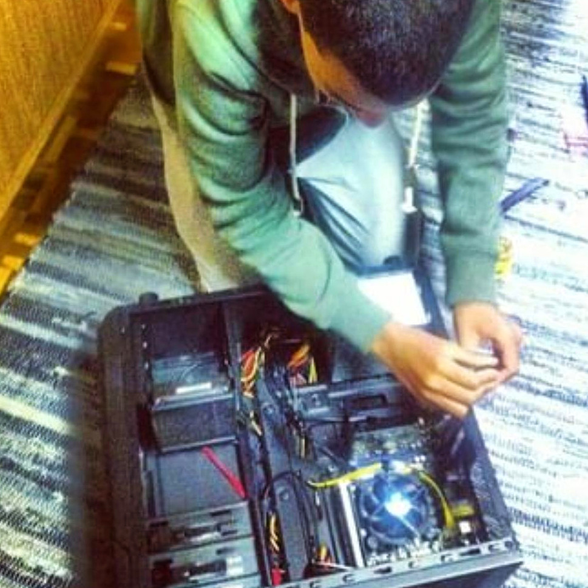

+++
author = "Josh"
title = "Alot"
date = "2023-04-26"
description = "🎵💗"
tags = [
    "mindset",
    "personal"
]
categories = [
    "Fluff",
]
image = "misty.jpg"
+++
<!--more-->

## Intro & Context

<center>

I've been contemplating about whether or not it would be appropriate to write about this in a professional sense.
Everyone has their own experiences, things they've done, things they hide and most importantly, how they feel.


<hr>

All situations are different, I'm not here to judge anyone. I'm here to tell my story, to myself, and to anyone who wants to read it.

<hr>


At this point I'm completely unfazed. 


```
47 🌊
```
Being true to myself above all else is better than a potential work environment that won't accept me for who I am. I truly believe that. I'm getting better at understanding my value.

</center>


<p align="center">
  
</p>

It would be a **disservice** to my future self for not writing about this. I'm pretty sure on that.

</center>

## Melodies and Heightened senses - Context

I haven't really tried [*hard drugs*](https://www.government.nl/topics/drugs/how-does-the-law-distinguish-between-soft-and-hard-drugs) before, up until now. I've been a cigarette smoker since before tertiary education and would drink occasionally if I ever went out. These are legal.

I haven't talked about this but I used to study Computer Science at [UWC(University of the Western Cape)](https://www.uwc.ac.za/). Basically I always knew I loved computer related stuff - making things, figuring out problems and feeling like a wizard. I was about 11 years old when I started messing with computers.

<p align="center">
  
</p>


Problem was, I got into the 'wrong friend group' and lasted about 2 months. We would skip classes occasionally and smoke weed pretty much everyday. I'm grateful for the experience because it taught me how to be responsible and actually take my future seriously. I was 18 at the time. 

### Festival Experiences
<center>

```
All you need is music, love and people 💙 
```
</center>

That's the most important lesson I've learned in the past 2 festivals that I've recently been to. Hard drugs are there to **'aid'** in the experience but not necessarily '**facilitate**' it. To those who might be reading this, I don't condone the use of psychedelics in any way. I'm simply sharing my experience.

### MDMA
```
Methyl​enedioxy​methamphetamine, also known as molly/e/ecstacy
```
This small lil thing is magical. I never felt so much love and empathy for everyone around me, including myself. I just wanted to give hugs to everyone I met. I never felt judged, like I was completely 100% myself. It's probably the most powerful truth serum ever. No surprise it's put to use in [therapy](https://www.nature.com/articles/s41591-021-01336-3). Problem is, it's illegal and most importantly, [neurotoxic](https://www.ninds.nih.gov/health-information/disorders/neurotoxicity).

### LSD
```
Lysergic acid diethylamide, also known as acid
```
This thing blew me away. My perception of everything was heightened, my body felt different. Everything was moving. Time became completely distorted which is mind-boggling. It made me wonder just how other animals could be viewing the world through their lens and how the world we see and know could actually be something else entirely.

## Melodies and Heightened senses 

I sort of believe our brain has different 'configurations'. Drugs sort of 'unlock' other ones. Certain situations in real life can also 'unlock' other ones. Not remaining in the same 'state' actually causes memories to be recalled differently ([State-dependent memory](https://en.wikipedia.org/wiki/State-dependent_memory)). 

The one we use in our day to day is the one that's most useful for survival. It's the one that's most efficient.

After these experiences and what I've been through, I've realized the importance of love and dancing as a healing tool. There are so, so, so many things we cannot express with words and cadence. Visuals, thoughts and emotions can't be explained, only felt. There's waves, vibrations, touch, taste, smell, sight, sound and so much more. Actions speak volumes.

It's a beautiful thing to be able to express yourself through music and dance. Right now, I listen to music about 2 hours **minimum** during my day to day activities. Every single night before bed, I dance for about 20-30 minutes by myself whenever I get the chance. 

My head becomes clear, it's stimulating and it allows me to reflect back on past events without negative emotions. Sort of feels like I'm getting things out of my system. I become comfortable with myself and just let my body move how it wants. It's my own form of meditation.

This has been my favourite tune, it feels warm.




## Love
Love is everything. In hope, love keeps it alive. In happiness, love is the reason. In sadness, love is the cure. In hate, love is the forgiveness. In pain, love is the healing. 

```
In the end, love is all there is. 💕
```

Simply giving love to yourself and others is the most important thing. A hug, a compliment or a smile goes a long way.

The game of life makes this easy to forget sometimes.


