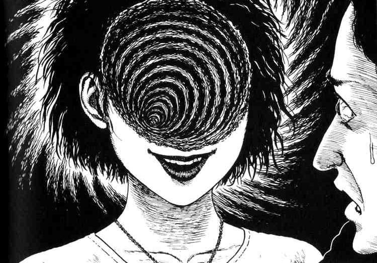

+++
author = "Josh"
title = "Probability and Psychological Biases"
date = "2023-03-14"
description = "🤯"
tags = [
    "learning"
]
categories = [
    "Educational"
]
image = "chadspace.jpg"
+++
<!--more-->

## What is probability anyway?

Personally I'm not a math guy but I find probability interesting. More specifically, the psychology behind how we perceive probability.

Defining probability can be quite brain wracking to think about. We're trying to quantify something that is inherently unquantifiable. Trying to understand an event that is fundamentally random. Very abstract if I'm being honest.


## Perceiving Probability

We aren't computers, so in term's of **feeling and perceiving** probability, we're not very good at it.

### Gambler's Fallacy

For example, lets suppose you have a fair coin and you flip it about 5 times.
Lets suppose now that you get heads 5 times in a row.

You might think to yourself, "Ok, surely the next flip will be tails, right?".

Thats called the [**Gambler's Fallacy**](https://www.investopedia.com/terms/g/gamblersfallacy.asp). It's quite a powerful psychological phenomenon that can be used to manipulate people into making bad decisions.

### Availability Heuristic

Lets say you're at the arcade and you're playing the game with the claw, trying to get a specific teddy bear.

Suppose you get the teddy bear and don't try it again. Someone else informs you that the probability of getting the bear is 1 in 5000. You won't internalize that information because you've gotten the bear you wanted on the first try. The next time you play the game, your tolerance for stopping will be much, much higher than the average person.

If someone else asks you what the probability of getting the bear is, you might remember someone mentioning "1 in 5000" but you won't exactly **feel and percieve** it as 1 in 5000.

This is called the [**Availability Heuristic**](https://thedecisionlab.com/biases/availability-heuristic). It's a cognitive bias that causes us to overestimate the probability of events that are more easily recalled. It can lead to poor decision-making because memories that are easy to recall are often inadequate for determining the likelihood of future events.

<p align="center">
  
</p>

#### Salience and Salient Events

Basically, salience is the degree to which something stands out or like how noticeable something is.
So, in the context of the previous example, the memory of getting the bear is more salient than the memory of not getting the bear, so you overestimate the probability of getting the bear.

As another example, someone may overestimate the risk of a plane crash because highly publicized plane crashes are more salient in their memory than the much more frequent and conversely, less publicized car accidents. Important to note that this is different on an individual basis.

This might cause people to: 
- Overestimate the risk of plane crashes and underestimate the risk of car accidents.
- Drive more recklessly, like driving while texting or driving while intoxicated.

Both undesirable but hey, we are assosiation machines.

### Confirmation Bias
This is another cognitive bias that causes us to **seek** out information that confirms our beliefs and **ignore** information that contradicts our beliefs.

Like for example on reddit (similarly with other forms of social media), you are much more likely to follow a subreddit that agrees with your beliefs and you are much less likely to follow a subreddit that disagrees with your beliefs.

```
Basically putting yourself in an echo chamber with no way in from the outside.
```
<p align="center">
  
</p>


But I digress, that's a whole other topic...

Sorry bout the scary image ❤️

Back to probability.

For a confirmation bias example regarding probability, imagine someone strongly believes that their favorite sports team is going to win a game.

They've been following the team for years and they've seen them win many games. They've also seen them lose many games, but they've **never** seen them lose to this specific opposing team.

They may seek out and focus on information that supports their belief, like stats that show their team has a good record, while ignoring stats that contradicts their belief, like that the opposing team has a winning streak or a strong defense or something.

They could then easily overestimate the probability of their team winning the game.

### Anchoring Bias

This causes people to rely too heavily on a single piece of information when making decisions. It's also known as the **first impression effect**.

In the context of probability, people could base their estimates on arbitrary or irrelevant reference points, rather than on accurate information.

For example, suppose someone asked you the probability of a certain event occurring. Your first instinct is to recall the probability of similar events or make an estimate based on context but that isn't relevant for this example.

However, before you make your estimate, the person asking you the question, tells you that the answer is between 20% and 40%. This is an arbitrary range, but it serves as an anchor point for your estimate.

You might end up saying 30%, which is right in the middle of 20% and 40%, even if the actual answer is much lower or much higher.

<p align="center">
  
</p>

### Hindsight Bias

Hindsight bias is simply when someone looks back at an event and believes they predicted the outcome, even if they failed to act on that "prediction". It's also known as the **'I knew it all along phenomenon'**. It might not seem relevant in terms of probability because probability is about predicting the unforeseeable future, but lemme explain.

While probability is about predicting the future, hindsight bias can still be a problem because it can distort our perception of the accuracy of our predictions.

Suppose you hear that the stock market is soon to crash. However, you decide not to sell your stocks because you think the market is too unpredictable anyways and you don't want to miss out on potential gains. Eventually, the market does actually crash and you lose money.

After the crash, you might look back and think that it was obvious that the market was going to crash, and that you should have sold your stocks when you had the chance. This is hindsight bias.

The problem with this is that it can lead people to overestimate their ability to predict or control the likelihood of future events based on their past experiences or knowledge.

## Ending Off

There's a lot more to dive into but I hope you enjoyed this little dive into probability and how we might perceive things differently to how they actually are. I definitely enjoyed writing and exploring this topic, was quite refreshing 😊
<center>


Peace ✌️

</center>


