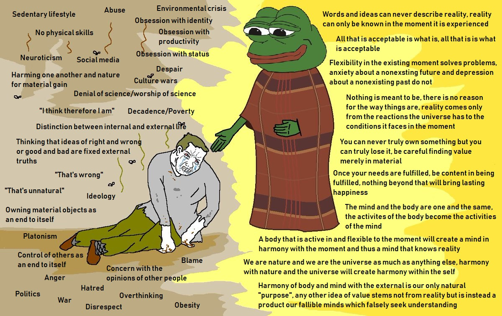
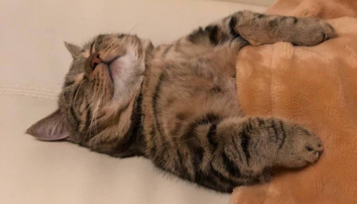

+++
author = "Josh"
title = "Taoism and Rastafarianism"
date = "2022-03-30"
description = "Just vibin anon..."
toc = true
tags = [
    "mindset",
    "personal"
]
categories = [
    "fluff"
]
image = "420.jpg"
+++
<!--more-->

## Disclaimer

Firstly, I want to emphasize that what I am about to say is highly subjective and is part of my personal interpretation.
I decided to write this because I find both fascinating.

### Their Origins

For context sake, Taoism has been around for a really long time; since around the 4th century, and started in China. Rastafarianism actually started as a political movement in the 1930s in Jamaica and emerged from the **Abrahamic** religions, namely Christianity and Judaism and as such, is monotheistic.  

This is also where the stark contrast between the two lies. The key word is movement. Rastafarianism never emerged solely because of religious values, but it is still essential and grounded in the movement. Taoism was purely philosophical, devoid of any politics.

## The definition of Religion

Religion is a difficult word to define. I personally believe both these belief systems can be defined rather as a "Way of Life" instead. 

I feel that when a 'religion' has more strict beliefs, is unified and becomes widely institutionalized, it falls under the 'religion' category. Example's would be Christianity, Hinduism, Islam including their many respective forms and so on. However, that's not to say places of worship for Taoism and Rastafarianism do not exist, because they do. 

Both Taoism and Rastafari Culture embrace the idea of treading on your **own** path to enlightenment, finding peace and content in life's simple joys . Albeit in Rastafarianism it is much more of a collective effort.

## Nature and Lifestyle

In both beliefs, there is a lot of importance placed upon living in harmony and peace with nature.
It is by far the most **crucial** aspect of both.

I find that often in our day to day lives, we search for meaning and substance in material things.
We consume content, turn to the arts like literature and music, buy things we need or might not that serve some kind of purpose.

In the end its all kinda just pointless depending on how you view it, at least it is for me.
When you stop for a second, take everything in and find peace and content by simply feeling and existing, that matters. 

How often, do you kinda just forget you have ownership of something? Or how often that one song or show you enjoyed eventually just slips out of your mind? The lessons and experiences I've learned in my life will never leave me. It feels much closer to my heart. 

### Diet
Rastas are primarily vegan. Their diet is called **"Ital"**. They do this because it is believed that a diet free of additives, chemicals and meat is neccessary in order to stay healthy and more spiritually connected to Earth. 

The Tao believe the same essentially; eating as close to natural as possible including little meat.  

* Both discourage the consumption of substances such as nicotine and alcohol as well as other drugs.
* Both look down on political systems, violence and authoritarianism.

I used to be vegetarian for around 4 months. Not because of the influences of any religion, mainly animal cruelty and because I honestly feel like humanity is a plague to the earth. Consuming meat is not a necessity by any pragmatical means.  Unfortunately I lost a significant amount of weight and it was quite difficult to have a diet different from my family's without personal income. I plan on continuing once I am self-independent.  

## Ending off
I don't necessarily *follow* Taoism or Rastafarianism. There are aspects are disagree upon in both, more so in Rastafari Culture because of its misogynistic views.
