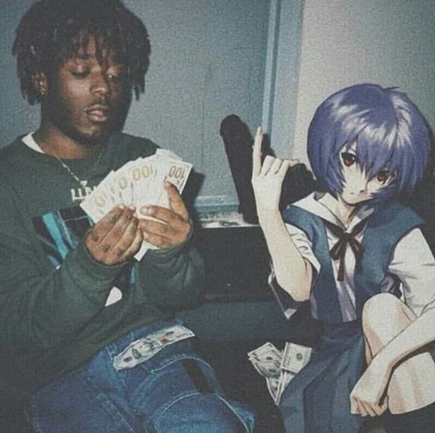
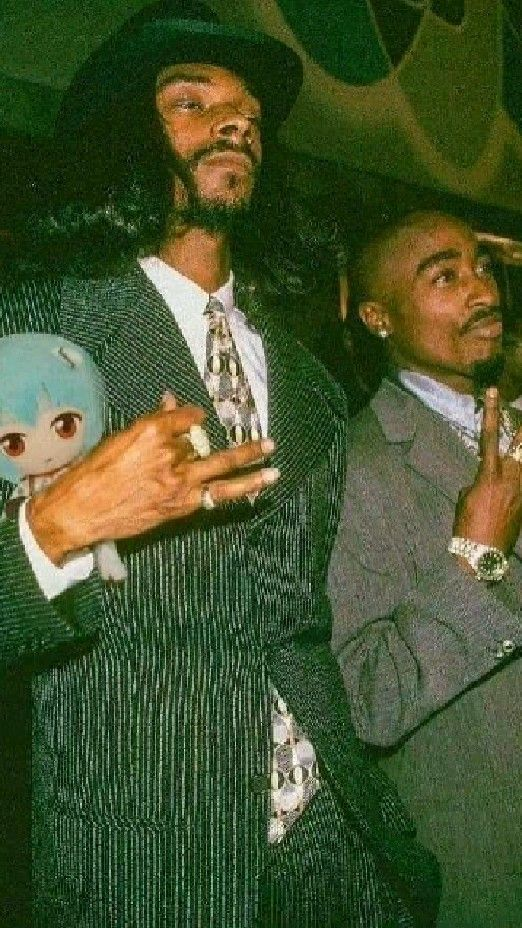
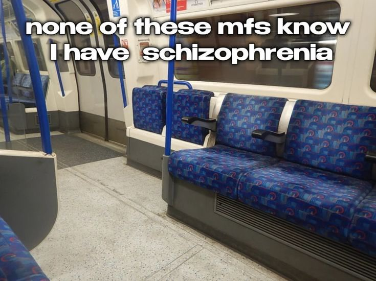
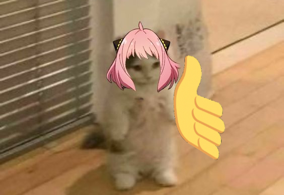

+++
author = "Josh"
title = "Can relationships be non-transactional?"
date = "2022-12-07"
description = "💼"
tags = [
    "personal"
]
categories = [
    "Fluff"
]
image = "banner.png"
+++
<!--more-->

The pictures have no relation to the post whatsoever. I just find them funny 😎👍

## Intro
I thought about this a couple days ago. About why in some instances I seem to have zero interest in improving relationships with people. 

I think when we're younger we seem to have no problem with this. We're more open to new things in general because our lack of life experience. We're more willing to put in the effort to make things work and most importantly, **more malleable and impressionable**. We're still developing our own identity and are more willing to change our own beliefs and values to fit in with others. That's completely normal because its in our human nature.

  

Additionally, the threshold for a relatively acceptable level of trust is much lower. We're more willing to trust others and are more willing to give them the benefit of the doubt.  

## My personal experience

  

I've always been a moderately introverted person. 

During school and highschool I sorta let my friends **choose me** and I kinda just went with it. Only thing I cared about was fitting in. In general I was very open to new people and even if someone was ostracized, I'd still be willing to talk to them. This is still true as of now but to a lesser extent.

## How things have changed

I've been through so much in this past year and it has definitely been one of the most challenging and rewarding years of my life. I'd say the main theme of this year was loss. I can't really go into too much detail since this blog is public, but I've lost quite a few people in my life this year, some of which I had trusted and considered friends. I've also lost family members. 

What I've learnt

* Sometimes, certain people are not worth your time. And thats okay!
You've gotta listen to that inner voice that tells you that something is wrong. 
You've gotta trust your gut.

* Sometimes, you've gotta be selfish. You've gotta put yourself first. You've gotta put your own needs first over everything else, **no matter what**.

## Why every relationship is transactional
I cannot ever see myself being in a relationship with someone where I'm not getting anything out of it.

* **I'm not saying** that I'm only in relationships with people who can give me something. 
 
* **I'm saying** that I'm only in relationships with people who can give me something **and** I can give them something in return.

 ### Why is this important?
 If there is a transactional imbalance, the relationship is un-sustainable. No matter how much you try to make it work, it will eventually fail. What is an imbalance? Put simply it means that one person is giving more than the other. During a relationship its normal for the balance to shift occasionally.

 This is really important. The transaction **CANNOT** be driven by ulterior motives. For example, you might decide to pursue a relationship where you give more than you receive in order to get something out of it. You start to assume that the other person will eventually give you something in return. I myself am guilty of this and it's a very dangerous mindset to have. People **DO NOT** work like investments.
 
 
 It **HAS** to be driven by genuine interest in the other person. You have to genuinely care about the other person and want to see them succeed. You have to genuinely want to help them and be there for them. You have to genuinely want to see them happy. 
 
 If you don't feel like this, is it really worth it?

 

  

## Conclusion

Basically no. Relationships cannot be non-transactional. One might argue that family relationships are non-transactional. I'd argue that they are. The reason why is because together, you've established a level of trust and care that is beneficial to both parties. Personally I don't believe in blood being thicker than water. I think that family relationships are just as transactional as any other relationship. People are people.

  

## Random
Outta context. Really enjoyed this movie recently. Absolutely beautiful. Highly recommend it, its dope 😎👍


