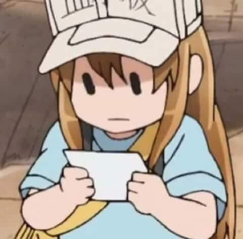
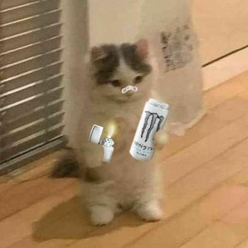

+++
author = "Josh"
title = "My Monster Collection"
date = "2022-01-04"
description = "😈"
tags = [
    "personal",
]
categories = [
    "fluff",
    "short",
]
image = "cans.jpg"
+++
<!--more-->

This is what it looks like at the time of writing this. It probably took around 4 years?\
I've drank from each and every can because why not right? I guess it's more valuable if it's still sealed? idk

I remember that one day I wen't over to my cousin's and he had a bunch of Red Bull cans stacked on a shelf. 
That's where I got the idea for collecting Monster cans. I thought they'd look prettier with all of the different colours.
Every friday after school I'd search for a new one at the gas station to take back home. 

South Africa lags behind the rest of the world in pretty much everything. Shipping is insanely expensive, most things you find in grocery/convenience stores are made locally. The only one in my collection you cannot find locally is the Monster Punch. I got that from eBay.

The variety here doesn't even come **close** to the variety in first world countries. It legitimately takes years for us to get new ones. To grow the collection at a faster rate I'd have to order cans from overseas but that's pretty costly.

They'll discontinue some flavours eventually. That's when the collection would mean a lot more to me.

