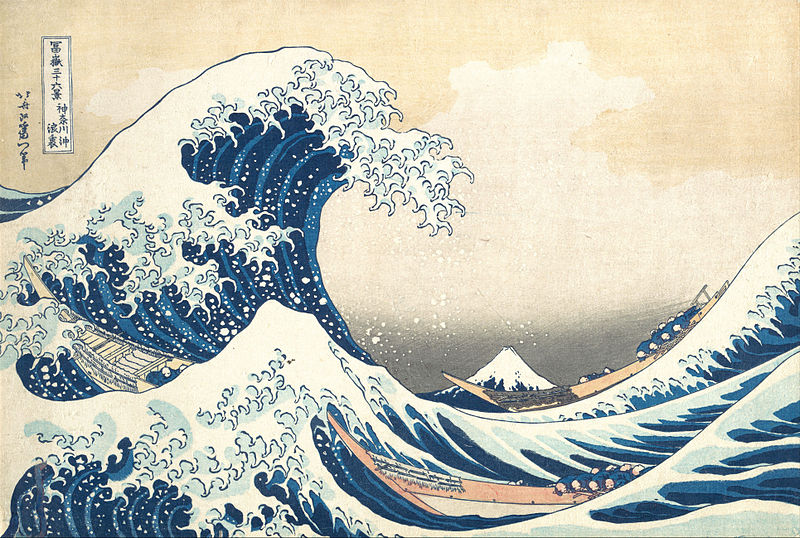
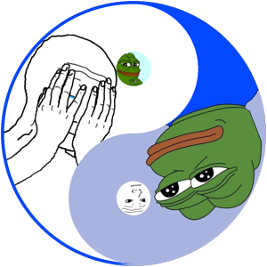

+++
author = "Josh"
title = "An Explanation on Ocean's 47"
date = "2021-12-18"
description = "What does it actually mean and why is it so significant to me?"
tags = [
    "mindset",
    "personal",
]
categories = [
    "fluff",
]
image = "steez.jpg"
+++

The man above is Courtney Jamal Dewar Jr, more commonly known as **Capital Steez**.
<!--more-->

## Who is Capital Steez?

Capital Steez **was**. He was a rapper from Brooklyn, New York. 
He was part of the colletive group; [Pro Era](https://en.wikipedia.org/wiki/Pro_Era). 

Pro Era or rather the Progressive Era, started out as just a group of friends in highschool, including my favourite rapper, [Joey Bada$$](https://en.wikipedia.org/wiki/Joey_Badass).

### Capital Steez - Apex


## Explanation 

I'm not going to go into detail about Steez's life.
He was Joey's best friend and unfortunately committed suicide on the 23rd of December 2012.
The numbers on date on his death ```12/23/12``` add up to 47.
His last message was "THE END". 
The next album in his career was going to be called "47 Shift".


### Long live Steelo Edit


I'm just simply going to explain "Ocean's 47".

I'm going to break it up into three parts.
* The number **47**
* The word **Ocean**
* Links to **Taoism / Daoism**

"Oceans 47" is a line from the track "Ring the Alarm" by Joey Bada$$, Meechy Darko, Kirk Knight and Nyck Caution.

```
"Death before dishonor, I die for brethren
This is a stick-up, ocean's 47
Ring the alarm..."
```
## The Number 47

Steez was a leader. He told his peers to do something meaningful with their lives and they followed.
The number 47 would mean nothing to Pro Era without Steez.
Steez saw the number 47 as the perfect number. It is a prime number. The number 4, represents the 4th or **Heart** Chakra. The number 7, represents the 7th or **Crown** Chakra.

According to Steez, its the balance of the heart and mind. The balance of logical and irrational thinking. He believed that when connecting with others, you need to be sympathetic and caring while also not being completely heartless and logical. Now there's also the **[47th problem of Euclid](https://www.masonic-lodge-of-education.com/47th-problem-of-euclid.html)**, more commonly known as the **Pythagorean** theorem. There's also connections with the number 47 and the **Swastika** symbol. There is **also** "angel numbers" and many more stuff.

Unrelated to the **number itself**, is the **["Apollonian" and "Dionysian"](https://faculty.fiu.edu/~harrisk/Notes/Aesthetics/Apollonian-%20Dionysian%20Dichotomy.htm)** - directly opposing (however not antithetical) sides of Greek Culture which Friedrich Nietzsche mentioned in his work, 'The Birth of Tragedy'. These dualistic and opposing 'forces' are represented by the two Greek Gods; Apollo and Dionysus. 

* Apollo represents reason, rationality, calm and fortitude. 
* Dionysus represents impulse, emotion, instinct and chaos.

In simplification, Nietzsche asserted that to be content with oneself is to control the balance of these two forces.




I don't believe there is anything significant about the number and it's various connections really. It's about what it represents to me. 
Steez's music was highly influential and had left a mark on me.

I do believe that there needs to be a balance between the heart and mind. The number 47 represents this to me. 
I think too rationally at times; to the point where I can't connect with others.


## The Word Ocean 

In the **lyrics** of the song, "Ocean" was simply a reference to the movie **["Oceans Eleven" (2001)](https://www.imdb.com/title/tt0240772/)**. 

To me, it has a different meaning. When I think of an ocean, I think of water endlessly flowing and never resting. Waves crashing. From afar, it is still. On the shore, it exerts its tremendous kinetic energy on the surrounding area. In another blog I'll talk about my trip to Japan, but it also reminds me of the Great Wave of Hokusai for this reason.

### The Great Wave of Hokusai



The wave dominates the composition, emphasizing its relative size in comparison to Mount Fuji behind it and the men that are rowing for their lives. 
Its destructive when energetic, yet friendly and welcoming when its not. 
In a similar fashion, I feel that when people are calm and collected, they are more approachable. 
More present. 
Their calming and understanding essence feels soothing and even *medicinal*. 
I'd like to be this kind of person to the people I care most about, while also not being completely rational and lacking empathy in some respect.

In this way, I feel the word Ocean is strongly linked to the number 47. I don't think lyrics necessarily have to have a single-defined meaning. Its fine to interpret them in your own way as you like.

## Taosim




I remember back in highschool, we were tasked with researching a religion of our choice.

I don't even think Taoism is a *religion* per say. Its more like a philosophy or a way of life.
Basically it focuses on a balanced way of living life. Living life in harmony and with nature.
Importantly, in Taoism, opposites rely on each other to coexist. 
This is the *only religion* that I've ever come across in my life that is the most sensible and agreeable for me personally.
In this way, its linked to the dualistic behaviour of the **ocean** and the **balance of chakras**.

This is one of my favourite quotes from Lao Tzu, the founding philosopher of Taoism.

```
When people see things as beautiful, ugliness is created. ~ Lao Tzu
```


## Ending Off

Hope you enjoyed this short read. TLDR: I believe that having a balance in life is important. 
I highly recommend to check out some of Capital Steez's music if enjoy you 'Boom-Bap' as a subgenre or just rap in general. 
Peace <3.


