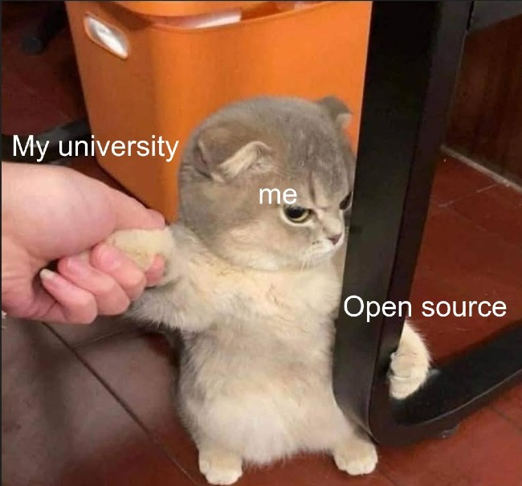

+++
author = "Josh"
title = "Software in Schools"
date = "2021-12-26"
description = "I must resist anon. They will not take me alive..."
tags = [
    "rant",
]
categories = [
    "fluff",
    "short",
]
image = "baked.jpg"
+++
<!--more-->

## Rant

Schools make deals with whatever company and start paying for licenses on a mass scale.
Adobe this, Microsoft this, Autodesk this.

It establishes a dependent relationship between the company, the institution **and** the students.
Isn't the whole point of going to school to make you an independent, critical-thinking member of society?

Germany is pretty based and have already opened their eyes. Have a read [here](https://thenextweb.com/news/german-schools-ban-microsoft-office-365-amid-privacy-concerns).

How is a student supposed to pay an exorbitant amount of money for all of this nonsense when alternatives exist that accomplish the same goal? 

Moreover, the devs at these companies don't give two f*** about the consumers. 
That's not what they **really** get paid to do.
Teams monitor and collect user data like we're in some huge guinea pig farm and make the appropriate changes to maximize revenue and get on top of their competitors. 
But no look! This student has certified photoshop skills! They must be good at photo editing!

For any tech space **other** than game development, it's not bad. You can pretty much do whatever you want on anything.

I'm currently studying Game Dev.
It's **especially** bad in game development when you've got all the major engines that are proprietary like Unity and Unreal Engine.

* Nvidia will stick to proprietary drivers because Nvidia.
* Epic Games is an absolute monster of a company.
* Steam is proprietary.
* Discord, the main platform for communication amongst gamers is proprietary. 
* Gaming peripheral companies don't care at all about open source.
* All major games primarily run on Windows.
* Tencent, Tencent, Tencent, Tencent, Tencent.

**It's like one long chain of poop.**

But muh games! I want to play muh games!
It's so easy to turn the blind eye for the sake of convenience.
It feels like that's all people want nowadays.

Stores like [GOG](https://www.gog.com/about_gog) and [Itch.io](https://itch.io/) are actually pretty good. 
They actually care.
