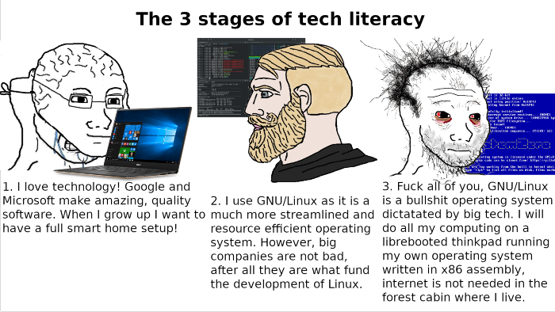

+++
author = "Josh"
title = "My Journey and how you can get started with using Linux"
date = "2021-12-12"
description = "Some of my reasons for using Linux and a mini-guide 📄"
tags = [
    "development"
]
categories = [
    "guide"
]
image = "screenshot.png"
+++
<!--more-->

If you watched any Linus Tech Tips videos about Linux, **ignore** all of it *unless* **Anthony** or **Luke** said something.
They actually know what they're talking about.

## My Journey

During my first year of Uni, I stumbled across a random video explaining virtual machines. I thought it was the coolest thing ever. Soon after, I downloaded [VirtualBox](https://www.virtualbox.org/) and tried random Linux distributions  (*distros*).

If you're new to all of this, think of distros as "*flavours*" of Linux. Linux is actually just the kernel.
I'm not really gonna get into that in this post but basically when people say Linux, they are usually referring to GNU/Linux. GNU is basically a collection of core software and utilities. If you're interested in learning more, peep the video below.



I just could not believe how empowering it felt. For context, I've been installing and using Windows my entire life, using some shady techniques to change it, debloat it and bypass the license. Always complaining about the shitty File Explorer, Microsoft Edge, garbage Media Player, yadayada.
I was dumbfounded.

I always pirated software that wasn't free because well, I didn't earn any money and there's no way I could even *afford* paying for any Microsoft or Adobe software.
In general, I don't like being **forced** to do something in a certain way. 
I also want the **freedom** to do whatever I want with the software I use.

I was lost at first, like any normal person would be. 
I was just really confused about many things.
Why was there so many different ways to do the same thing?
What the heck is a package manager?
What is the difference between a Desktop Environment and a Window Manager?
Oh my god a terminal! 



The more I used it on a daily basis, the more I grew to absolutely love the development ecosystem to bits.
Everything I normally did became that much more efficient. I had the freedom to do essentially, anything I could possibly imagine.
The best part? No limitations and no one pulling any strings. It was **my** system.

I started automating tasks through scripts and it was just mindblowing to me.
Of course you can write scripts in other operating systems but I personally I feel like Linux makes it much easier. Bash is one of the simplest shells, python is pre-installed on most distros. 
Vim was something I didn't even know existed. 
The whole journey made me take a step back and really think about many, many aspects of software I hadn't thought about before.
Source code, webapps, compatibility, modularity, backend, efficiency, UX, underlying frameworks and languages, all that good stuff.

You don't like the way a program does a certain thing? Sure bro, here's the source code, do whatever you want.

* "Waaaaaah Windows Update again!!" 😭
* "Omg!!! I cant use this feature unless I upgrade my program!!" 😭
* "Just let me uninstall damn Edge!!" 😡💢
* "Why do I need to login to setup my pc??" 😭
* "Wtf is this cortana shit popping up??" 😭

## The Unix Philosophy 
Basically, the Unix philosophy is to do **one** thing and do it **well.** Make it modular, simple and effective. 
Read more about it [**here**](https://homepage.cs.uri.edu/~thenry/resources/unix_art/ch01s06.html).

I'm not going to go in-depth about how important this is for developing software,  but basically it makes talking to other programs really easy and keeps things as minimal and simple as possible. 
In Windows, software is packaged with all its dependencies in one huge ass program and a shitty installer.
It's **monolithic** and bloated as hell.

To install something, you usually go into a browser and download some suspicious setup.exe. Odds are, you will have no idea what its actually doing under the hood and have no way of knowing unless its open source. To fend it off you have Window's built in antivirus which isn't even necessary in the first place if Windows was just fucking secure.

I personally cannot stand it. For context I easily have around 9000 hours plus using Windows. 

If you're unfamiliar with the idea of free software (not just cost), I highly recommend watching this [Ted Talk](https://youtu.be/Ag1AKIl_2GM) by a very, very **based** individual. 

## Learning resources

If you'd like to get started, this is a pretty good first video.



Go on youtube and find a tutorial for VirtualBox and just try any distribution before you install it on bare metal.

### Youtube Channels

* [Luke Smith](https://www.youtube.com/c/LukeSmithxyz) - best one
* [Mental Outlaw](https://www.youtube.com/c/MentalOutlaw)
* [BugsWriter](https://www.youtube.com/c/BugsWriter0x1337)

### Websites

* [Linux Journey](https://linuxjourney.com/) 
* [Arch Wiki](https://wiki.archlinux.org/) - Not just for Arch
* [Mankier](https://www.mankier.com/) - manuals for every command

### But... but which Distro should I start with?
Don't read bullshit articles that are like **"TOP 10 LINUX DISTROS"**.
It literally doesn't matter. Just don't start with Gentoo first unless you're a masochist.

In *my* opinion don't start off with distros that are derived from other ones. For example Ubuntu is based off Debian and Manjaro is based off Arch. Just use the base because they'll have more solid documentation.

Don't make your decision based on Xorg vs Wayland or SystemD vs another init system if you don't know what those are in the first place.

Also, don't make your choice depending on what other people say, which contradicts everything I just said.
Choice is good. Whatever you do is up to you.

### But... but how do I learn?
http://www.readthefuckingmanual.com/

In general, be **very open** to learning. Don't force doing something in a way you did it before just because you already know how to do that specific thing in a specific way. 

Your way of doing things was probably heavily influenced by the tailored user experience by Microsoft/Apple etc.

Generally, strive for efficiency. Over time, you'll eventually realize how much easier and simpler Linux is.

### Compatibility

If you have some fancy hardware that uses proprietary software then forget it.
If you want rgb puke lights from your new Razer keyboard then forget it.

For example, I use a [Logitech MX Master 2s](https://www.logitech.com/en-us/eol/mx-master-2s-mouse.910-005131.html) as my mouse.
There's no way im getting to use all the fancy gestures in the [software](https://images-na.ssl-images-amazon.com/images/I/91c8SQfG8cS.pdf).

Gaming controllers will work.
Most printers will work.
Bluetooth works.

Did you know that the Corsair iCUE software is 800 MB?
Nearly 1GB for fucking lights. That's literally **just** the installer.
These companies can just get away with nonsense because people don't have a choice.
Why support companies like this?

## Gaming 
You can play plenty games on Linux.
If you're a hardcore gamer, as in you wanna play all sorts of different games, Linux isn't for you right now.
What you could do is dual-boot which is what I do but for different reasons. I have to because of University.

If you start using Linux, don't get into messing with all the settings in Wine and Lutris. Its such a waste of time and effort.

## Ending Off

TLDR: If you care about using software that respects your privacy and that you are free to change, use Linux. Here's a meme video.


