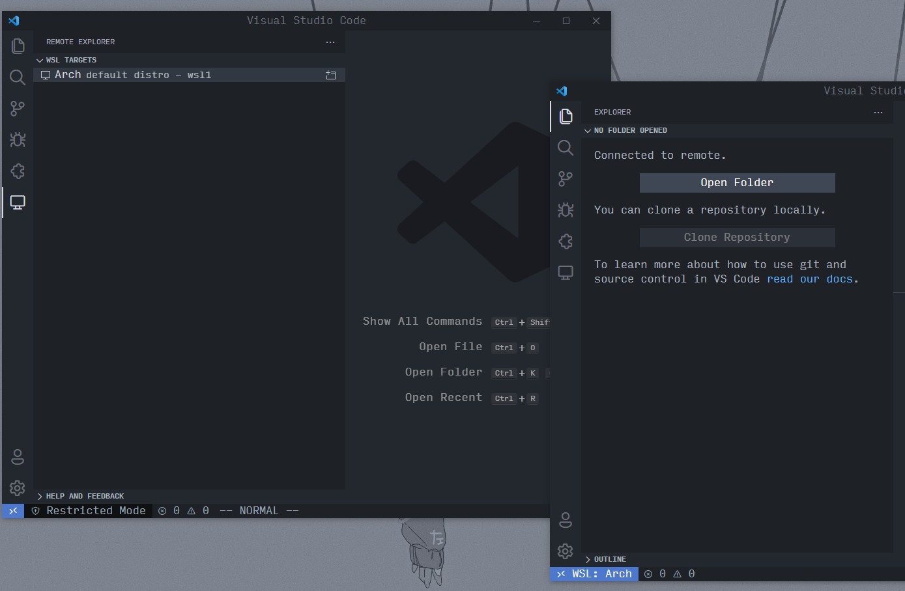
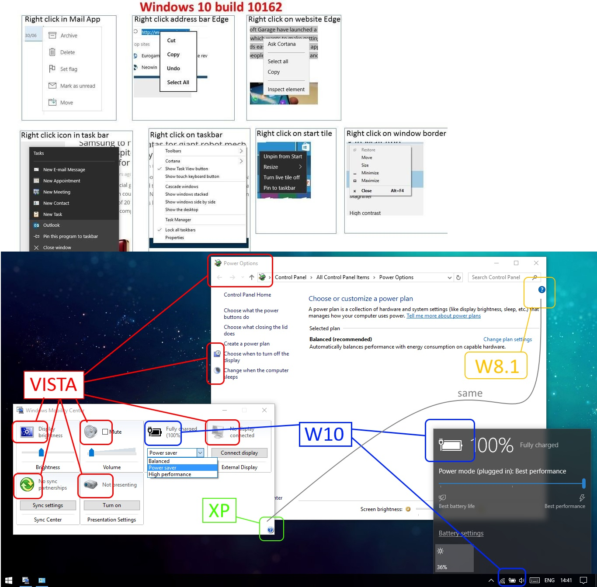

+++
author = "Josh"
title = "WSL is crazy good!!!!! OMG!!!"
date = "2022-01-13"
description = "It just werks. What're you waiting for?"
tags = [
    "development"
]
categories = [
    "loonix"
]
image = "banner.jpg"
+++
<!--more-->

I tried it the first time today. Honestly, it's extremely impressive and I haven't even tried WSL2 yet.

## Context
WSL is the Windows Subsystem for Linux. Basically its just lets you have a GNU/Linux environment in tandem with Windows without any headaches like a virtual machine. 

Currently I dual-boot and its been okay-ish. It's not that I **want** to dual-boot, in fact if my course had the given me the choice, I would simply just stay on linux.

## Going back to Windows?
The development environment is pretty nice. Only issue is I have with Windows is that it's too complex and convoluted.

It's not nearly as snappy and efficient as on linux and there's so much overhead and restrictions I just **do not** want in my system at all. I have a 144hz monitor, GTX 1060, 16GB of ram and an i7 5960X (all of these are running stock, stopped overlocking a while ago). 

Even with debloat scripts and all fancy animations disabled on Windows, it's still relatively slow.
For my laptop, its definitely still going to be Linux only on there because of hardware. 

However, I **was** surprised at some of the new tools that had been released recently. I've only scratched the surface of these so take whatever I say with a grain of salt.

These include:
* [Microsoft PowerToys (2019)](https://github.com/microsoft/PowerToys) 
* [Winget (Windows Package Manager) (2020)](https://github.com/microsoft/winget-cli)
* [Windows Terminal (2019)](https://docs.microsoft.com/en-us/windows/terminal/install)

Okay firstly, why in the flying f*** did it take such a long time for Windows to have a standard package manager?
Chocolately has always been the OG but I guess Microsoft finally woke up. 
The whole ecosystem is such a nightmare.

I could use Winget straight from the get go. The experience reminded me of the fish shell. I actually really enjoy using it and thought it was pretty intuitive. 

Powershell is insanely good. Ironically, I have it on my arch install and enjoy messing with it. It's much more modern than bash and zsh. It's got alot of stuff I don't really need right now though.

The new Windows Terminal is pretty damn good. No complaints really. Works really well with WSL. Multiple tabs with different environments is siick.

## Workflow

I give it a solid 8/10 if privacy isn't your concern. It eliminates any and all OS restrictions when it comes to development. Drivers for everything. Very easy to use on the surface. Its just the best of both worlds.
Never gonna daily Windows though. 

### Visual Studio Code
This has been my go to IDE for the longest time. Really good integration with Git and Github, love its integration with the shell, works and is configured the same on any machine. Extension ecosystem is amazing.

Yeah I know Electron blah, blah, blah. Don't care 😴. Everything is web-based nowadays anyway.

WSL within VScode works like a charm.

### Virtual Machines
This was just absolutely mindblowing. You can have mulitple environments installed with very little overhead.
No need for docker or virtual machines or anything like that. WSL is fucking crazy. 

### Managing Windows and Customization.
Yeah I mean, nothing to say here. To say the window manager in PowerToys is rough around the edges is an understatement. It's getting there and right now its pretty impressive, so I am very hopeful. 

The problem doesn't lie with the Powertoys devs. They're doing amazing work. 

Windows has always been an absolute dumpster-fire and a complete mess after the glorious Windows 7.

## The Future
The best thing about these tools are that its open source and there's actually **money** behind it, contrary to the plethora of options you have on Unix systems where devs work on open source projects almost solely because of passion. 


